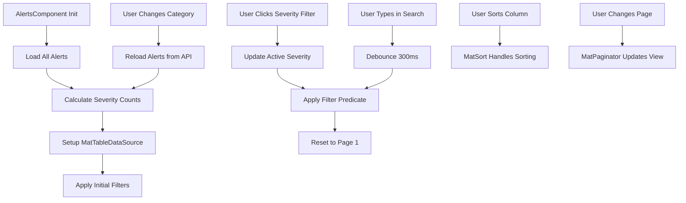

# Alerts Table Architecture Plan

## Overview
Transform the Alerts component from a card-based layout with tabs into a unified, real-time paginated table with severity-based filtering, search, and sorting capabilities.

## Current State Analysis

### Existing Implementation
- **Component**: [`alerts.component.ts`](../src/app/features/alerts/alerts.component.ts)
- **Display**: Card-based layout showing alerts individually
- **Filtering**: Dropdown for alert types (high-traffic, AI cannibalization, regional, seasonal, channel waste)
- **Styling**: Basic severity-based CSS classes
- **Pagination**: None (shows all alerts)
- **Search**: None
- **Sorting**: None

### Existing Assets to Reuse
1. **Alert Badge Component** ([`alert-badge.component.ts`](../src/app/shared/components/alert-badge/alert-badge.component.ts))
   - Severity icons: 🔴 Critical, 🟠 High, 🟡 Medium, 🔵 Low
   - Severity colors: Red (#d32f2f), Orange (#f57c00), Yellow (#fbc02d), Blue (#1976d2)
   - Alert formatting logic
   - Compact mode support

2. **Alert Service** ([`alerts.service.ts`](../src/app/core/services/alerts.service.ts))
   - `getAlerts()` - Get all alerts
   - Multiple specialized endpoints for different alert types

3. **Alert Model** ([`alerts.models.ts`](../src/app/core/models/alerts.models.ts))
   ```typescript
   interface Alert {
     message: string;
     severity: 'Critical' | 'High' | 'Medium' | 'Low';
     detectedAt: string;
     recommendedAction?: string;
     alertType?: string;
     entity?: string;
     value?: number;
     threshold?: number;
   }
   ```

## Requirements

### Functional Requirements
1. **Single Table Display**: All alerts in one unified table (no tabs)
2. **Pagination**: 10 records per page (configurable)
3. **Search**: Full-text search across all alert fields
4. **Sorting**: Sortable columns (severity, date, type, message)
5. **Severity Filter**: Visual filter with colored circles showing counts
6. **Category Filter**: Filter by alert type (existing functionality)
7. **Real-time Updates**: Maintain current data loading patterns
8. **Alert Styling**: Preserve dashboard alert appearance (colors, icons, formatting)

### UI/UX Requirements
1. **Severity Filter Design**:
   - Display all severities horizontally
   - Each severity shows: `[Icon] Severity (count)`
   - Clickable to filter by that severity
   - Visual indication of active filter
   - Example: `🔴 Critical (5)  🟠 High (12)  🟡 Medium (8)  🔵 Low (3)`

2. **Table Columns**:
   - Severity (icon + text)
   - Message
   - Alert Type
   - Recommended Action
   - Detected At (timestamp)

3. **Row Styling**:
   - Maintain severity-based left border colors
   - Hover effects
   - Compact but readable layout

## Architecture Design

### Component Structure

```
AlertsComponent
├── Severity Filter Bar (new)
│   ├── Critical Filter Button (with count)
│   ├── High Filter Button (with count)
│   ├── Medium Filter Button (with count)
│   └── Low Filter Button (with count)
├── Search & Filters Section
│   ├── Search Input (new)
│   └── Category Dropdown (existing, enhanced)
├── Results Info (new)
│   └── "Showing X of Y alerts"
├── Alerts Table (new)
│   ├── Table Header (sortable columns)
│   └── Table Rows (with alert badge styling)
└── Paginator (new)
```

### Data Flow



### State Management

```typescript
interface AlertsState {
  // Data
  allAlerts: Alert[];
  filteredAlerts: Alert[];
  
  // Loading states
  loading: boolean;
  error: string | null;
  
  // Filter state
  activeSeverity: string | null; // 'Critical' | 'High' | 'Medium' | 'Low' | null
  searchTerm: string;
  selectedCategory: string;
  
  // Severity counts
  severityCounts: {
    Critical: number;
    High: number;
    Medium: number;
    Low: number;
  };
}
```

## Implementation Strategy

### Phase 1: Setup Material Table Infrastructure
1. Import Angular Material modules:
   - `MatTableModule`
   - `MatSortModule`
   - `MatPaginatorModule`
   - `MatFormFieldModule`
   - `MatInputModule`
   - `MatSelectModule`
   - `MatButtonModule`
   - `MatIconModule`

2. Add `ReactiveFormsModule` for form controls

3. Setup `MatTableDataSource<Alert>`

### Phase 2: Create Severity Filter Component
1. Create severity filter bar UI
2. Calculate counts for each severity level
3. Implement click handlers for severity filtering
4. Add visual active state styling
5. Style with colored circles matching alert badge colors

### Phase 3: Implement Table Structure
1. Define table columns configuration
2. Create column templates with proper formatting
3. Integrate alert badge styling into table rows
4. Add severity-based row styling (left border colors)
5. Implement custom cell renderers for:
   - Severity (icon + text)
   - Message (truncated with tooltip)
   - Recommended Action (truncated with tooltip)
   - Detected At (formatted date)

### Phase 4: Add Search and Filtering
1. Create search input with debounce (300ms)
2. Implement custom filter predicate:
   - Search across: message, alertType, recommendedAction, entity
   - Filter by severity (from severity filter bar)
   - Filter by category (existing dropdown)
3. Add "Clear Filters" functionality
4. Display filtered results count

### Phase 5: Implement Sorting
1. Add `matSort` directive to table
2. Make columns sortable:
   - Severity (by severity level order)
   - Message (alphabetical)
   - Alert Type (alphabetical)
   - Detected At (chronological, default desc)
3. Add sort indicators

### Phase 6: Add Pagination
1. Add `MatPaginator` component
2. Configure page size: 10 (default), with options [10, 25, 50]
3. Connect paginator to data source
4. Add "first page" navigation on filter changes

### Phase 7: Styling and Polish
1. Apply consistent styling with other tables (channels, keywords, regions)
2. Add loading states (spinner overlay)
3. Add error states with retry button
4. Add empty state ("No alerts found")
5. Ensure responsive design
6. Add hover effects and transitions

## Technical Specifications

### Column Definitions

```typescript
displayedColumns = [
  'severity',      // Icon + text
  'message',       // Main alert message
  'alertType',     // Category/type badge
  'recommendedAction', // Action text
  'detectedAt'     // Formatted timestamp
];
```

### Filter Predicate Logic

```typescript
filterPredicate = (alert: Alert, filter: string): boolean => {
  const filterObj = JSON.parse(filter);
  
  // Severity filter
  const severityMatch = !filterObj.severity || 
    alert.severity === filterObj.severity;
  
  // Search filter
  const searchTerm = filterObj.search.toLowerCase();
  const searchMatch = !searchTerm ||
    alert.message.toLowerCase().includes(searchTerm) ||
    (alert.alertType || '').toLowerCase().includes(searchTerm) ||
    (alert.recommendedAction || '').toLowerCase().includes(searchTerm) ||
    (alert.entity || '').toLowerCase().includes(searchTerm);
  
  return severityMatch && searchMatch;
};
```

### Severity Sorting Logic

```typescript
const severityOrder = { 'Critical': 0, 'High': 1, 'Medium': 2, 'Low': 3 };

sortData = (data: Alert[], sort: MatSort): Alert[] => {
  if (sort.active === 'severity') {
    return data.sort((a, b) => {
      const order = sort.direction === 'asc' ? 1 : -1;
      return (severityOrder[a.severity] - severityOrder[b.severity]) * order;
    });
  }
  // Default sorting for other columns
  return data;
};
```

### Severity Count Calculation

```typescript
calculateSeverityCounts(alerts: Alert[]): SeverityCounts {
  return alerts.reduce((counts, alert) => {
    counts[alert.severity] = (counts[alert.severity] || 0) + 1;
    return counts;
  }, {
    Critical: 0,
    High: 0,
    Medium: 0,
    Low: 0
  });
}
```

## UI Component Specifications

### Severity Filter Bar

```html
<div class="severity-filters">
  <button 
    *ngFor="let severity of severities"
    class="severity-filter-btn"
    [class.active]="activeSeverity === severity"
    [class]="'severity-' + severity.toLowerCase()"
    (click)="filterBySeverity(severity)">
    <span class="severity-icon">{{ getSeverityIcon(severity) }}</span>
    <span class="severity-label">{{ severity }}</span>
    <span class="severity-count">({{ severityCounts[severity] }})</span>
  </button>
  <button 
    *ngIf="activeSeverity"
    class="clear-severity-btn"
    (click)="clearSeverityFilter()">
    Clear Filter
  </button>
</div>
```

### Table Row Styling

```css
.alert-row {
  border-left: 4px solid transparent;
  transition: all 0.2s ease;
}

.alert-row.severity-critical {
  border-left-color: #d32f2f;
}

.alert-row.severity-high {
  border-left-color: #f57c00;
}

.alert-row.severity-medium {
  border-left-color: #fbc02d;
}

.alert-row.severity-low {
  border-left-color: #1976d2;
}

.alert-row:hover {
  background-color: #f5f5f5;
  transform: translateX(2px);
}
```

### Severity Cell Template

```html
<ng-container matColumnDef="severity">
  <th mat-header-cell *matHeaderCellDef mat-sort-header>Severity</th>
  <td mat-cell *matCellDef="let alert" class="severity-cell">
    <span class="severity-badge" [class]="'severity-' + alert.severity.toLowerCase()">
      <span class="severity-icon">{{ getSeverityIcon(alert.severity) }}</span>
      <span class="severity-text">{{ alert.severity }}</span>
    </span>
  </td>
</ng-container>
```

## Integration Points

### With Existing Components
1. **Alert Badge Component**: Reuse styling constants and icon logic
2. **Data Table Component**: Use as reference for table patterns (not directly used)
3. **Dashboard Component**: Maintain consistent alert display patterns

### With Services
1. **AlertsService**: Continue using existing API methods
2. Keep current category-based filtering logic
3. Maintain error handling patterns

## Performance Considerations

1. **Change Detection**: Use `OnPush` strategy
2. **Search Debouncing**: 300ms delay on search input
3. **Virtual Scrolling**: Not needed for 10 items per page
4. **TrackBy Function**: Implement for table rows
5. **Signals**: Use Angular signals for reactive state (following channels pattern)

## Accessibility

1. **ARIA Labels**: Add to all interactive elements
2. **Keyboard Navigation**: Full keyboard support via Material components
3. **Screen Reader Support**: Proper table semantics
4. **Focus Management**: Maintain focus on filter changes

## Testing Considerations

1. **Unit Tests**:
   - Filter predicate logic
   - Severity count calculation
   - Sort comparator functions
   - Search debouncing

2. **Integration Tests**:
   - Table rendering with data
   - Filter interactions
   - Pagination behavior
   - Sort functionality

3. **E2E Tests**:
   - Complete user workflows
   - Filter combinations
   - Search and pagination

## Migration Path

### Breaking Changes
- Remove tab-based layout from dashboard (if needed)
- Update any direct references to alert card structure

### Backward Compatibility
- Keep existing API service methods unchanged
- Maintain alert model structure
- Preserve severity color scheme

## Success Criteria

1. ✅ All alerts displayed in single paginated table
2. ✅ 10 records per page with pagination controls
3. ✅ Search functionality across all alert fields
4. ✅ Sortable columns (severity, date, type, message)
5. ✅ Severity filter with colored circles and counts
6. ✅ Category filter dropdown working
7. ✅ Alert styling matches dashboard appearance
8. ✅ Real-time data loading maintained
9. ✅ Responsive design on all screen sizes
10. ✅ Loading and error states properly handled

## Future Enhancements

1. **Export Functionality**: Export filtered alerts to CSV/Excel
2. **Bulk Actions**: Select multiple alerts for batch operations
3. **Alert Details Modal**: Click row to see full alert details
4. **Date Range Filter**: Filter alerts by detection date
5. **Auto-refresh**: Periodic data refresh for real-time updates
6. **Alert Acknowledgment**: Mark alerts as read/acknowledged
7. **Alert History**: View resolved/dismissed alerts
8. **Custom Columns**: User-configurable column visibility
