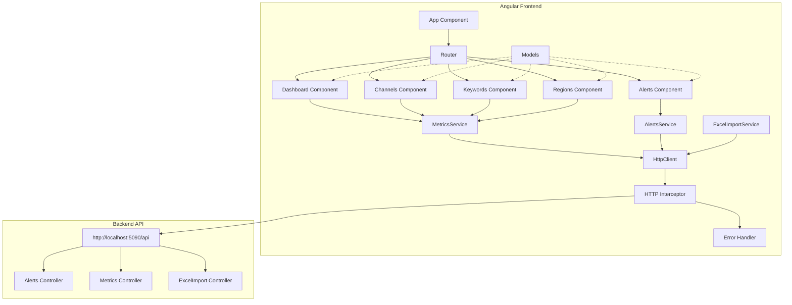

# Angular 16+ Frontend Generation Plan for SolveoDashboardAssignment.Web

## Project Overview

**Project Name:** SolveoDashboardAssignment.Web  
**Backend API:** SolveoDashboardAssignment.Api  
**API Base URL:** `http://localhost:5090/api`  
**Angular Version:** 18.2.0 (compatible with Angular 16+ patterns)  
**Architecture:** Standalone components (no NgModules)

## Current Project Status

### Existing Structure
```
src/app/
├── core/
│   ├── models/          (empty - needs models)
│   └── services/
│       └── api.service.ts (basic service - needs expansion)
├── features/
│   ├── dashboard/       (basic component)
│   ├── alerts/          (empty component)
│   ├── channels/        (empty component)
│   ├── keywords/        (empty component)
│   └── regions/         (empty component)
└── shared/
    └── components/      (empty)
```

### Existing Configuration
- ✅ HttpClient configured in app.config.ts
- ✅ Environment file with apiUrl
- ✅ Routing configured for all features
- ✅ Standalone components architecture

## API Analysis from Swagger Specification

### API Controllers & Endpoints

#### 1. **Alerts Controller** (`/api/Alerts`)
- `GET /api/Alerts` - Get alerts with date range
- `GET /api/Alerts/high-traffic-low-conversion` - High traffic, low conversion alerts
- `GET /api/Alerts/ai-overview-cannibalization` - AI overview cannibalization alerts
- `GET /api/Alerts/regional-underperformance` - Regional underperformance alerts
- `GET /api/Alerts/seasonal-dips` - Seasonal dips alerts
- `GET /api/Alerts/channel-waste` - Channel waste alerts

#### 2. **Metrics Controller** (`/api/Metrics`)
- `GET /api/Metrics/monthly/latest` - Latest monthly metrics
- `GET /api/Metrics/monthly` - Monthly metrics with date range
- `GET /api/Metrics/monthly/mrr-growth` - MRR growth metrics
- `GET /api/Metrics/regional` - Regional metrics with filters
- `GET /api/Metrics/regional/trial-to-paid` - Trial to paid conversion by region
- `GET /api/Metrics/regional/traffic-trends` - Regional traffic trends
- `GET /api/Metrics/regional/cac-ltv` - CAC/LTV by region
- `GET /api/Metrics/channels` - Channel metrics
- `GET /api/Metrics/channels/conversion-rates` - Channel conversion rates
- `GET /api/Metrics/keywords` - Keyword metrics
- `GET /api/Metrics/keywords/traffic-change` - Keyword traffic changes

#### 3. **ExcelImport Controller** (`/api/ExcelImport`)
- `POST /api/ExcelImport/import` - Import Excel file (multipart/form-data)

### Data Models from Swagger

#### Defined Schemas
1. **ImportStatisticsDto**
   - sheetStats: Record<string, SheetStatistics>
   - totalRowsAllSheets: number
   - totalImportedAllSheets: number
   - totalSkippedAllSheets: number
   - globalErrors: string[]

2. **SheetStatistics**
   - sheetName: string
   - totalRows: number
   - importedRows: number
   - skippedRows: number
   - errors: string[]

#### Inferred Models (from endpoint patterns)
Since most endpoints return 200 OK without detailed response schemas, we'll need to create generic models based on common patterns:

- **MonthlyMetrics** - for monthly endpoint responses
- **RegionalMetrics** - for regional endpoint responses
- **ChannelMetrics** - for channel endpoint responses
- **KeywordMetrics** - for keyword endpoint responses
- **Alert** - for alert endpoint responses
- **DateRangeParams** - for common query parameters
- **ApiError** - for error responses

## Implementation Plan

### Phase 1: Core Models Generation

Create TypeScript interfaces in `src/app/core/models/`:

#### File Structure
```
src/app/core/models/
├── index.ts                          (barrel export)
├── common.models.ts                  (shared types)
├── alerts.models.ts                  (alert-related models)
├── metrics.models.ts                 (metrics-related models)
└── excel-import.models.ts            (import-related models)
```

#### Models to Create

**common.models.ts:**
```typescript
- DateRangeParams
- ApiError
- ApiResponse<T>
- PaginationParams
- FilterParams
```

**alerts.models.ts:**
```typescript
- Alert
- HighTrafficLowConversionParams
- AiOverviewCannibalizationParams
- RegionalUnderperformanceParams
- SeasonalDipsParams
- ChannelWasteParams
```

**metrics.models.ts:**
```typescript
- MonthlyMetrics
- MonthlyMetricsParams
- MrrGrowthMetrics
- RegionalMetrics
- RegionalMetricsParams
- TrialToPaidMetrics
- TrafficTrendsMetrics
- CacLtvMetrics
- CacLtvParams
- ChannelMetrics
- ChannelMetricsParams
- ChannelConversionRates
- KeywordMetrics
- KeywordMetricsParams
- KeywordTrafficChange
- KeywordTrafficChangeParams
```

**excel-import.models.ts:**
```typescript
- ImportStatisticsDto (from Swagger)
- SheetStatistics (from Swagger)
- ImportResponse
```

### Phase 2: Service Generation

Create dedicated services in `src/app/core/services/`:

#### File Structure
```
src/app/core/services/
├── index.ts                          (barrel export)
├── alerts.service.ts                 (Alerts API)
├── metrics.service.ts                (Metrics API)
├── excel-import.service.ts           (Excel Import API)
└── http-error.interceptor.ts        (Error handling)
```

#### Services to Create

**alerts.service.ts:**
- `getAlerts(params?: DateRangeParams): Observable<Alert[]>`
- `getHighTrafficLowConversion(params?: HighTrafficLowConversionParams): Observable<Alert[]>`
- `getAiOverviewCannibalization(params?: AiOverviewCannibalizationParams): Observable<Alert[]>`
- `getRegionalUnderperformance(params?: DateRangeParams): Observable<Alert[]>`
- `getSeasonalDips(params?: DateRangeParams): Observable<Alert[]>`
- `getChannelWaste(params?: ChannelWasteParams): Observable<Alert[]>`

**metrics.service.ts:**
- `getLatestMonthlyMetrics(): Observable<MonthlyMetrics>`
- `getMonthlyMetrics(params?: MonthlyMetricsParams): Observable<MonthlyMetrics[]>`
- `getMrrGrowth(): Observable<MrrGrowthMetrics>`
- `getRegionalMetrics(params?: RegionalMetricsParams): Observable<RegionalMetrics[]>`
- `getTrialToPaid(params?: DateRangeParams): Observable<TrialToPaidMetrics[]>`
- `getTrafficTrends(params?: DateRangeParams): Observable<TrafficTrendsMetrics[]>`
- `getCacLtv(params?: CacLtvParams): Observable<CacLtvMetrics[]>`
- `getChannelMetrics(params?: ChannelMetricsParams): Observable<ChannelMetrics[]>`
- `getChannelConversionRates(params?: DateRangeParams): Observable<ChannelConversionRates[]>`
- `getKeywordMetrics(params?: KeywordMetricsParams): Observable<KeywordMetrics[]>`
- `getKeywordTrafficChange(params?: KeywordTrafficChangeParams): Observable<KeywordTrafficChange[]>`

**excel-import.service.ts:**
- `importExcelFile(file: File): Observable<ImportStatisticsDto>`

**http-error.interceptor.ts:**
- Global HTTP error handling
- Logging
- User-friendly error messages

### Phase 3: Component Updates

Update existing components to use typed services and models:

#### Dashboard Component
**Location:** `src/app/features/dashboard/dashboard.component.ts`

**Features:**
- Display latest monthly metrics
- Show MRR growth chart
- Display key performance indicators
- Error handling with user feedback
- Loading states

**Dependencies:**
- MetricsService
- MonthlyMetrics model
- MrrGrowthMetrics model

#### Alerts Component
**Location:** `src/app/features/alerts/alerts.component.ts`

**Features:**
- List all alerts
- Filter by alert type
- Date range filtering
- Display alert details
- Error handling

**Dependencies:**
- AlertsService
- Alert model
- DateRangeParams

#### Channels Component
**Location:** `src/app/features/channels/channels.component.ts`

**Features:**
- Display channel metrics
- Show conversion rates by channel
- Date range filtering
- Channel comparison
- Error handling

**Dependencies:**
- MetricsService
- ChannelMetrics model
- ChannelConversionRates model

#### Keywords Component
**Location:** `src/app/features/keywords/keywords.component.ts`

**Features:**
- Display keyword performance
- Show traffic changes
- Filter by category
- Traffic range filtering
- Error handling

**Dependencies:**
- MetricsService
- KeywordMetrics model
- KeywordTrafficChange model

#### Regions Component
**Location:** `src/app/features/regions/regions.component.ts`

**Features:**
- Display regional metrics
- Show trial-to-paid conversion
- Traffic trends by region
- CAC/LTV analysis
- Error handling

**Dependencies:**
- MetricsService
- RegionalMetrics model
- TrialToPaidMetrics model
- TrafficTrendsMetrics model
- CacLtvMetrics model

### Phase 4: Error Handling & Interceptors

#### HTTP Error Interceptor
**Location:** `src/app/core/services/http-error.interceptor.ts`

**Features:**
- Catch HTTP errors globally
- Transform errors to user-friendly messages
- Log errors to console (or external service)
- Handle specific status codes (401, 403, 404, 500, etc.)
- Retry logic for transient failures (optional)

**Configuration:**
- Register in `app.config.ts` providers

### Phase 5: Shared Components (Optional Enhancement)

Create reusable UI components in `src/app/shared/components/`:

```
src/app/shared/components/
├── loading-spinner/
├── error-message/
├── date-range-picker/
└── metric-card/
```

## Technical Implementation Details

### Type Safety
- All API calls will be strongly typed
- Use TypeScript interfaces for all models
- Leverage RxJS operators for data transformation
- Use Angular's HttpParams for query parameters

### Error Handling Strategy
```typescript
// Service level
catchError((error: HttpErrorResponse) => {
  console.error('API Error:', error);
  return throwError(() => new ApiError(error));
})

// Component level
.subscribe({
  next: (data) => { /* handle success */ },
  error: (error) => { /* display error message */ }
})
```

### Query Parameter Building
```typescript
// Example for building HttpParams
buildParams(params: any): HttpParams {
  let httpParams = new HttpParams();
  Object.keys(params).forEach(key => {
    if (params[key] !== null && params[key] !== undefined) {
      if (Array.isArray(params[key])) {
        params[key].forEach(value => {
          httpParams = httpParams.append(key, value);
        });
      } else {
        httpParams = httpParams.set(key, params[key]);
      }
    }
  });
  return httpParams;
}
```

### Date Handling
- Use ISO 8601 format for date parameters
- Convert JavaScript Date objects to ISO strings
- Handle timezone considerations

### File Upload (Excel Import)
```typescript
importExcelFile(file: File): Observable<ImportStatisticsDto> {
  const formData = new FormData();
  formData.append('file', file);
  
  return this.http.post<ImportStatisticsDto>(
    `${this.baseUrl}/ExcelImport/import`,
    formData
  );
}
```

## Architecture Diagram



## File Generation Checklist

### Models (9 files)
- [ ] `src/app/core/models/index.ts`
- [ ] `src/app/core/models/common.models.ts`
- [ ] `src/app/core/models/alerts.models.ts`
- [ ] `src/app/core/models/metrics.models.ts`
- [ ] `src/app/core/models/excel-import.models.ts`

### Services (5 files)
- [ ] `src/app/core/services/index.ts`
- [ ] `src/app/core/services/alerts.service.ts`
- [ ] `src/app/core/services/metrics.service.ts`
- [ ] `src/app/core/services/excel-import.service.ts`
- [ ] `src/app/core/services/http-error.interceptor.ts`

### Components (5 updates)
- [ ] `src/app/features/dashboard/dashboard.component.ts`
- [ ] `src/app/features/alerts/alerts.component.ts`
- [ ] `src/app/features/channels/channels.component.ts`
- [ ] `src/app/features/keywords/keywords.component.ts`
- [ ] `src/app/features/regions/regions.component.ts`

### Configuration (1 update)
- [ ] `src/app/app.config.ts` (add HTTP interceptor)

### Documentation (1 file)
- [ ] `README-API-INTEGRATION.md` (usage guide)

**Total Files:** 21 files (5 new model files, 4 new service files, 1 interceptor, 5 component updates, 1 config update, 2 index files, 1 documentation)

## Usage Examples

### Example 1: Dashboard Component Using Typed Service

```typescript
import { Component, OnInit } from '@angular/core';
import { MetricsService } from '../../core/services';
import { MonthlyMetrics, MrrGrowthMetrics } from '../../core/models';
import { CommonModule } from '@angular/common';

@Component({
  selector: 'app-dashboard',
  standalone: true,
  imports: [CommonModule],
  templateUrl: './dashboard.component.html',
  styleUrls: ['./dashboard.component.css']
})
export class DashboardComponent implements OnInit {
  monthlyMetrics: MonthlyMetrics | null = null;
  mrrGrowth: MrrGrowthMetrics | null = null;
  loading = false;
  error: string | null = null;

  constructor(private metricsService: MetricsService) {}

  ngOnInit(): void {
    this.loadDashboardData();
  }

  loadDashboardData(): void {
    this.loading = true;
    this.error = null;

    this.metricsService.getLatestMonthlyMetrics().subscribe({
      next: (data) => {
        this.monthlyMetrics = data;
        this.loading = false;
      },
      error: (err) => {
        this.error = 'Failed to load monthly metrics';
        this.loading = false;
        console.error(err);
      }
    });

    this.metricsService.getMrrGrowth().subscribe({
      next: (data) => {
        this.mrrGrowth = data;
      },
      error: (err) => {
        console.error('Failed to load MRR growth:', err);
      }
    });
  }
}
```

### Example 2: Alerts Component with Filtering

```typescript
import { Component, OnInit } from '@angular/core';
import { AlertsService } from '../../core/services';
import { Alert, DateRangeParams } from '../../core/models';
import { CommonModule } from '@angular/common';
import { FormsModule } from '@angular/forms';

@Component({
  selector: 'app-alerts',
  standalone: true,
  imports: [CommonModule, FormsModule],
  templateUrl: './alerts.component.html',
  styleUrls: ['./alerts.component.css']
})
export class AlertsComponent implements OnInit {
  alerts: Alert[] = [];
  loading = false;
  error: string | null = null;
  
  dateRange: DateRangeParams = {
    startDate: new Date(Date.now() - 30 * 24 * 60 * 60 * 1000).toISOString(),
    endDate: new Date().toISOString()
  };

  constructor(private alertsService: AlertsService) {}

  ngOnInit(): void {
    this.loadAlerts();
  }

  loadAlerts(): void {
    this.loading = true;
    this.error = null;

    this.alertsService.getAlerts(this.dateRange).subscribe({
      next: (data) => {
        this.alerts = data;
        this.loading = false;
      },
      error: (err) => {
        this.error = 'Failed to load alerts';
        this.loading = false;
        console.error(err);
      }
    });
  }

  loadHighTrafficLowConversion(): void {
    this.alertsService.getHighTrafficLowConversion({
      minTraffic: 2000,
      maxConversion: 1.5
    }).subscribe({
      next: (data) => {
        this.alerts = data;
      },
      error: (err) => {
        this.error = 'Failed to load high traffic alerts';
        console.error(err);
      }
    });
  }
}
```

## Benefits of This Approach

1. **Type Safety**: Full TypeScript type checking across the entire application
2. **Maintainability**: Clear separation of concerns with dedicated services and models
3. **Reusability**: Services can be used across multiple components
4. **Testability**: Services and components can be easily unit tested
5. **Error Handling**: Centralized error handling with interceptors
6. **Scalability**: Easy to add new endpoints and models
7. **Developer Experience**: IntelliSense and autocomplete for all API calls
8. **Documentation**: Self-documenting code with TypeScript interfaces

## Next Steps

1. Review and approve this plan
2. Switch to Code mode to implement the generation
3. Test the generated services with the backend API
4. Iterate on component implementations based on actual API responses
5. Add unit tests for services and components
6. Add integration tests for critical user flows

## Notes

- The Swagger specification doesn't include detailed response schemas for most endpoints, so we'll create generic models that can be refined once we see actual API responses
- Consider adding response interceptors to transform API responses if needed
- May need to add authentication/authorization interceptors in the future
- Consider adding a loading service for global loading state management
- Consider adding a notification/toast service for user feedback
