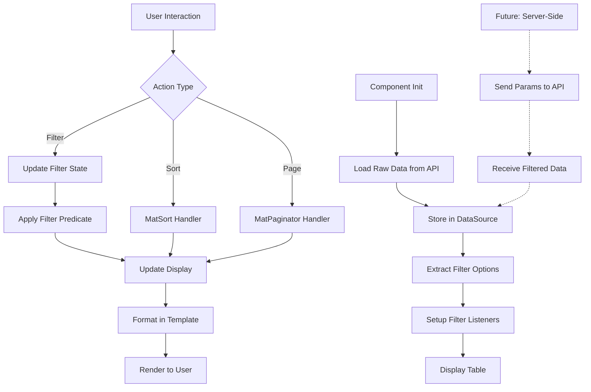

# Channels Table Component Architecture Plan (v2 - Production Ready)

## Overview
Transform the channels component to display a comprehensive data table with enterprise-grade architecture, following Angular best practices for maintainability, scalability, and type safety.

## Architectural Improvements

This version incorporates production-ready patterns:
- ✅ Separated data models (monthly vs aggregated)
- ✅ Template-level formatting (no formatted fields in models)
- ✅ OnPush change detection strategy
- ✅ Strict typing (no index signatures)
- ✅ Scalability considerations for server-side operations

---

## API Endpoint
- **URL**: `http://localhost:5090/api/Metrics/channels/all`
- **Method**: GET
- **Response Format**: Array of channel metrics objects

### Sample Response Data
```json
{
  "month": "2024-01",
  "channel": "Organic Search",
  "sessions": 18626,
  "signups": 575,
  "conversionRate": 3.09,
  "avgSessionDurationSec": 342,
  "bounceRate": 0.56,
  "pagesPerSession": 4.2
}
```

---

## Data Model Architecture

### Separated Interfaces

#### 1. ChannelMonthlyMetrics (New)
Represents raw monthly data from the API - matches the `/channels/all` endpoint response.

```typescript
/**
 * Monthly channel performance metrics
 * Represents raw data from API endpoint: /api/Metrics/channels/all
 */
export interface ChannelMonthlyMetrics {
  month: string;                    // Format: "YYYY-MM"
  channel: string;                  // Channel name (e.g., "Organic Search")
  sessions: number;                 // Total sessions count
  signups: number;                  // Number of signups
  conversionRate: number;           // Conversion rate percentage (e.g., 3.09)
  avgSessionDurationSec: number;    // Average session duration in seconds
  bounceRate: number;               // Bounce rate as decimal (0-1, e.g., 0.56 = 56%)
  pagesPerSession: number;          // Average pages per session
}
```

#### 2. ChannelAggregatedMetrics (New)
Represents aggregated/summarized channel data (for future use).

```typescript
/**
 * Aggregated channel metrics across time periods
 * Used for summary views and analytics
 */
export interface ChannelAggregatedMetrics {
  channel: string;
  totalSessions: number;
  totalSignups: number;
  avgConversionRate: number;
  avgSessionDurationSec: number;
  avgBounceRate: number;
  avgPagesPerSession: number;
  monthCount: number;               // Number of months aggregated
  periodStart?: string;             // Start of aggregation period
  periodEnd?: string;               // End of aggregation period
}
```

#### 3. Updated ChannelMetrics (Backward Compatibility)
Keep the existing interface for backward compatibility with other parts of the app.

```typescript
/**
 * Legacy channel metrics interface
 * Maintained for backward compatibility with existing code
 * @deprecated Use ChannelMonthlyMetrics or ChannelAggregatedMetrics instead
 */
export interface ChannelMetrics {
  channel: string;
  sessions: number;
  conversions?: number;
  conversionRate: number;
  totalSessions?: number;
  totalSignups?: number;
  averageSessionDuration?: number;
  monthCount?: number;
  cost?: number;
  roi?: number;
}
```

### Model Export Structure

Update [`src/app/core/models/metrics.models.ts`](../src/app/core/models/metrics.models.ts):

```typescript
// Export all channel-related interfaces
export { ChannelMonthlyMetrics } from './channel-monthly-metrics';
export { ChannelAggregatedMetrics } from './channel-aggregated-metrics';
export { ChannelMetrics } from './channel-metrics'; // Legacy
```

---

## Service Layer Updates

### MetricsService Enhancement

```typescript
/**
 * Get all channel metrics with monthly breakdown
 * Returns raw monthly data without formatting
 */
getAllChannelMetrics(): Observable<ChannelMonthlyMetrics[]> {
  return this.http.get<ChannelMonthlyMetrics[]>(`${this.baseUrl}/channels/all`);
}

/**
 * Get aggregated channel metrics (future implementation)
 * Supports server-side filtering and aggregation
 */
getAggregatedChannelMetrics(params?: {
  startDate?: string;
  endDate?: string;
  channels?: string[];
}): Observable<ChannelAggregatedMetrics[]> {
  const httpParams = this.buildParams(params);
  return this.http.get<ChannelAggregatedMetrics[]>(
    `${this.baseUrl}/channels/aggregated`, 
    { params: httpParams }
  );
}
```

---

## Component Architecture

### Change Detection Strategy

Use **OnPush** for better performance:

```typescript
@Component({
  selector: 'app-channels',
  changeDetection: ChangeDetectionStrategy.OnPush,
  // ...
})
```

Benefits:
- Reduces unnecessary change detection cycles
- Forces explicit state management
- Better performance with large datasets
- Aligns with enterprise Angular standards

### Component Structure

```typescript
interface FilterState {
  search: string;
  year: string;
  month: string;
  channel: string;
}

interface MonthOption {
  value: string;
  label: string;
}

@Component({
  selector: 'app-channels',
  standalone: true,
  imports: [
    CommonModule,
    ReactiveFormsModule,
    MatTableModule,
    MatSortModule,
    MatPaginatorModule,
    MatFormFieldModule,
    MatInputModule,
    MatSelectModule,
    MatIconModule,
    MatButtonModule,
    MatProgressSpinnerModule
  ],
  templateUrl: './channels.component.html',
  styleUrls: ['./channels.component.css'],
  changeDetection: ChangeDetectionStrategy.OnPush  // ✅ OnPush strategy
})
export class ChannelsComponent implements OnInit, AfterViewInit {
  
  // Table columns
  readonly displayedColumns: string[] = [
    'month',
    'channel',
    'sessions',
    'signups',
    'conversionRate',
    'avgSessionDurationSec',
    'bounceRate',
    'pagesPerSession'
  ];

  // Data source - uses raw ChannelMonthlyMetrics
  dataSource = new MatTableDataSource<ChannelMonthlyMetrics>([]);
  
  // State
  loading = signal(false);
  error = signal<string | null>(null);
  
  // Filter options
  years = signal<string[]>([]);
  readonly months: MonthOption[] = [
    { value: '01', label: 'January' },
    { value: '02', label: 'February' },
    { value: '03', label: 'March' },
    { value: '04', label: 'April' },
    { value: '05', label: 'May' },
    { value: '06', label: 'June' },
    { value: '07', label: 'July' },
    { value: '08', label: 'August' },
    { value: '09', label: 'September' },
    { value: '10', label: 'October' },
    { value: '11', label: 'November' },
    { value: '12', label: 'December' }
  ];
  channels = signal<string[]>([]);

  // Form controls
  readonly searchControl = new FormControl('', { nonNullable: true });
  readonly yearControl = new FormControl('all', { nonNullable: true });
  readonly monthControl = new FormControl('all', { nonNullable: true });
  readonly channelControl = new FormControl('all', { nonNullable: true });
  
  private filterState: FilterState = {
    search: '',
    year: 'all',
    month: 'all',
    channel: 'all'
  };

  private readonly destroyRef = inject(DestroyRef);
  private readonly cdr = inject(ChangeDetectorRef);

  @ViewChild(MatSort) sort!: MatSort;
  @ViewChild(MatPaginator) paginator!: MatPaginator;

  constructor(private readonly metricsService: MetricsService) {}

  // Lifecycle hooks
  ngOnInit(): void {
    this.loadChannelData();
    this.setupFilterListeners();
  }

  ngAfterViewInit(): void {
    this.dataSource.sort = this.sort;
    this.dataSource.paginator = this.paginator;
    this.paginator.pageSize = 10;
    this.dataSource.filterPredicate = this.createFilterPredicate();
    this.cdr.markForCheck();
  }

  // Data loading
  private loadChannelData(): void {
    this.loading.set(true);
    this.error.set(null);

    this.metricsService.getAllChannelMetrics()
      .pipe(takeUntilDestroyed(this.destroyRef))
      .subscribe({
        next: (data) => {
          this.dataSource.data = data;  // ✅ No mapping, use raw data
          this.extractFilterOptions(data);
          this.loading.set(false);
          this.cdr.markForCheck();
        },
        error: (err) => {
          this.error.set(err.message || 'Failed to load channel metrics');
          this.loading.set(false);
          this.cdr.markForCheck();
        }
      });
  }

  // Filter setup
  private setupFilterListeners(): void { /* ... */ }
  private createFilterPredicate(): (data: ChannelMonthlyMetrics, filter: string) => boolean { /* ... */ }
  private applyFilters(): void { /* ... */ }
  private extractFilterOptions(data: ChannelMonthlyMetrics[]): void { /* ... */ }

  // ✅ Formatting methods - called from template only
  formatNumber(value: number | null | undefined): string {
    if (value === null || value === undefined) return '-';
    return Math.round(value).toLocaleString('en-US');
  }

  formatPercentage(value: number | null | undefined): string {
    if (value === null || value === undefined) return '-';
    return `${value.toFixed(2)}%`;
  }

  formatDuration(seconds: number | null | undefined): string {
    if (seconds === null || seconds === undefined) return '-';
    const minutes = Math.floor(seconds / 60);
    const secs = Math.floor(seconds % 60);
    return `${minutes}:${secs.toString().padStart(2, '0')}`;
  }

  formatDecimal(value: number | null | undefined, decimals: number = 1): string {
    if (value === null || value === undefined) return '-';
    return value.toFixed(decimals);
  }

  formatBounceRate(rate: number | null | undefined): string {
    if (rate === null || rate === undefined) return '-';
    return `${(rate * 100).toFixed(2)}%`;
  }

  // Action methods
  clearSearch(): void {
    this.searchControl.setValue('');
  }

  resetFilters(): void {
    this.searchControl.setValue('');
    this.yearControl.setValue('all');
    this.monthControl.setValue('all');
    this.channelControl.setValue('all');
  }

  retry(): void {
    this.loadChannelData();
  }

  trackByChannelMonth(index: number, item: ChannelMonthlyMetrics): string {
    return `${item.channel}-${item.month}`;
  }
}
```

---

## Template-Level Formatting

### HTML Template Pattern

Instead of storing formatted values in the model, format in the template:

```html
<!-- ❌ OLD WAY: Using pre-formatted fields -->
<td mat-cell *matCellDef="let row">{{ row.formattedSessions }}</td>

<!-- ✅ NEW WAY: Format in template -->
<td mat-cell *matCellDef="let row">{{ formatNumber(row.sessions) }}</td>
```

### Complete Column Examples

```html
<!-- Sessions Column -->
<ng-container matColumnDef="sessions">
  <th mat-header-cell *matHeaderCellDef mat-sort-header>Sessions</th>
  <td mat-cell *matCellDef="let row">{{ formatNumber(row.sessions) }}</td>
</ng-container>

<!-- Signups Column -->
<ng-container matColumnDef="signups">
  <th mat-header-cell *matHeaderCellDef mat-sort-header>Signups</th>
  <td mat-cell *matCellDef="let row">{{ formatNumber(row.signups) }}</td>
</ng-container>

<!-- Conversion Rate Column -->
<ng-container matColumnDef="conversionRate">
  <th mat-header-cell *matHeaderCellDef mat-sort-header>Conversion Rate</th>
  <td mat-cell *matCellDef="let row">{{ formatPercentage(row.conversionRate) }}</td>
</ng-container>

<!-- Avg Session Duration Column -->
<ng-container matColumnDef="avgSessionDurationSec">
  <th mat-header-cell *matHeaderCellDef mat-sort-header>Avg Duration</th>
  <td mat-cell *matCellDef="let row">{{ formatDuration(row.avgSessionDurationSec) }}</td>
</ng-container>

<!-- Bounce Rate Column -->
<ng-container matColumnDef="bounceRate">
  <th mat-header-cell *matHeaderCellDef mat-sort-header>Bounce Rate</th>
  <td mat-cell *matCellDef="let row">{{ formatBounceRate(row.bounceRate) }}</td>
</ng-container>

<!-- Pages Per Session Column -->
<ng-container matColumnDef="pagesPerSession">
  <th mat-header-cell *matHeaderCellDef mat-sort-header>Pages/Session</th>
  <td mat-cell *matCellDef="let row">{{ formatDecimal(row.pagesPerSession, 1) }}</td>
</ng-container>
```

### Benefits of Template-Level Formatting

1. **Single Source of Truth**: Raw data remains unchanged
2. **Reusability**: Formatting functions can be used anywhere
3. **Testability**: Easy to unit test formatting logic
4. **Maintainability**: Clear separation of data and presentation
5. **Performance**: No unnecessary data transformation on load

---

## Scalability Considerations

### Current Implementation (Client-Side)

```typescript
// ✅ Good for: Small to medium datasets (< 10,000 records)
getAllChannelMetrics(): Observable<ChannelMonthlyMetrics[]> {
  return this.http.get<ChannelMonthlyMetrics[]>(`${this.baseUrl}/channels/all`);
}
```

**Pros:**
- Simple implementation
- Fast filtering/sorting once loaded
- No server round-trips for filters

**Cons:**
- Large initial payload
- Memory usage grows with data
- Slow initial load for large datasets

### Future Implementation (Server-Side)

For production scale, implement server-side operations:

```typescript
/**
 * Get paginated channel metrics with server-side filtering
 * @param params - Filter, sort, and pagination parameters
 */
getChannelMetricsPaginated(params: {
  page: number;
  pageSize: number;
  sortBy?: string;
  sortDirection?: 'asc' | 'desc';
  year?: string;
  month?: string;
  channel?: string;
  search?: string;
}): Observable<{
  data: ChannelMonthlyMetrics[];
  totalCount: number;
  page: number;
  pageSize: number;
}> {
  const httpParams = this.buildParams(params);
  return this.http.get<any>(`${this.baseUrl}/channels/paginated`, { params: httpParams });
}
```

**Migration Path:**
1. Start with client-side (current implementation)
2. Monitor data volume and performance
3. Switch to server-side when needed
4. Component code remains mostly the same (just change service call)

### Component Adaptation for Server-Side

```typescript
// Minimal changes needed in component
private loadChannelData(): void {
  this.loading.set(true);
  this.error.set(null);

  const params = {
    page: this.paginator?.pageIndex || 0,
    pageSize: this.paginator?.pageSize || 10,
    sortBy: this.sort?.active,
    sortDirection: this.sort?.direction,
    ...this.filterState
  };

  this.metricsService.getChannelMetricsPaginated(params)
    .pipe(takeUntilDestroyed(this.destroyRef))
    .subscribe({
      next: (response) => {
        this.dataSource.data = response.data;
        this.paginator.length = response.totalCount;
        this.loading.set(false);
        this.cdr.markForCheck();
      },
      error: (err) => {
        this.error.set(err.message || 'Failed to load channel metrics');
        this.loading.set(false);
        this.cdr.markForCheck();
      }
    });
}
```

---

## Type Safety Improvements

### Remove Index Signatures

```typescript
// ❌ OLD: Overly flexible, reduces type safety
export interface ChannelMetrics {
  channel: string;
  sessions: number;
  [key: string]: any;  // ❌ Allows anything
}

// ✅ NEW: Strict typing
export interface ChannelMonthlyMetrics {
  month: string;
  channel: string;
  sessions: number;
  signups: number;
  conversionRate: number;
  avgSessionDurationSec: number;
  bounceRate: number;
  pagesPerSession: number;
  // No index signature - all properties explicitly defined
}
```

### Benefits

1. **Compile-Time Safety**: TypeScript catches errors before runtime
2. **Better IDE Support**: Autocomplete and refactoring work correctly
3. **Self-Documenting**: Interface clearly shows all available properties
4. **Prevents Bugs**: Can't accidentally access non-existent properties

---

## Data Flow Diagram



---

## Implementation Checklist

### Phase 1: Data Models
- [ ] Create `ChannelMonthlyMetrics` interface
- [ ] Create `ChannelAggregatedMetrics` interface
- [ ] Update exports in `metrics.models.ts`
- [ ] Mark `ChannelMetrics` as deprecated

### Phase 2: Service Layer
- [ ] Add `getAllChannelMetrics()` method
- [ ] Add type annotations for return types
- [ ] Test API connectivity

### Phase 3: Component
- [ ] Update component to use `ChannelMonthlyMetrics`
- [ ] Implement OnPush change detection
- [ ] Use signals for reactive state
- [ ] Remove data mapping logic
- [ ] Add formatting methods

### Phase 4: Template
- [ ] Update template to call formatting methods
- [ ] Remove references to formatted fields
- [ ] Test all column displays

### Phase 5: Testing
- [ ] Unit test formatting methods
- [ ] Test filter combinations
- [ ] Test sorting and pagination
- [ ] Performance testing with large datasets

---

## Performance Optimizations

### 1. OnPush Change Detection
```typescript
changeDetection: ChangeDetectionStrategy.OnPush
```

### 2. TrackBy Function
```typescript
trackByChannelMonth(index: number, item: ChannelMonthlyMetrics): string {
  return `${item.channel}-${item.month}`;
}
```

### 3. Debounced Search
```typescript
this.searchControl.valueChanges
  .pipe(debounceTime(300), distinctUntilChanged())
  .subscribe(/* ... */);
```

### 4. Readonly Properties
```typescript
readonly displayedColumns: string[] = [/* ... */];
readonly months: MonthOption[] = [/* ... */];
```

---

## Testing Strategy

### Unit Tests

```typescript
describe('ChannelsComponent', () => {
  describe('Formatting Methods', () => {
    it('should format numbers with commas', () => {
      expect(component.formatNumber(18626)).toBe('18,626');
    });

    it('should format percentages with 2 decimals', () => {
      expect(component.formatPercentage(3.09)).toBe('3.09%');
    });

    it('should format duration as MM:SS', () => {
      expect(component.formatDuration(342)).toBe('5:42');
    });

    it('should convert bounce rate decimal to percentage', () => {
      expect(component.formatBounceRate(0.56)).toBe('56.00%');
    });

    it('should handle null values gracefully', () => {
      expect(component.formatNumber(null)).toBe('-');
      expect(component.formatPercentage(undefined)).toBe('-');
    });
  });

  describe('Filtering', () => {
    it('should filter by year', () => {
      // Test implementation
    });

    it('should filter by month', () => {
      // Test implementation
    });

    it('should combine multiple filters', () => {
      // Test implementation
    });
  });
});
```

---

## Migration Guide

### From Current to Production-Ready

1. **Update Models** (Breaking Change)
   ```typescript
   // Before
   dataSource = new MatTableDataSource<ChannelMetrics>([]);
   
   // After
   dataSource = new MatTableDataSource<ChannelMonthlyMetrics>([]);
   ```

2. **Remove Mapping Logic**
   ```typescript
   // Before
   const mapped = this.mapChannelData(data);
   this.dataSource.data = mapped;
   
   // After
   this.dataSource.data = data;  // Use raw data
   ```

3. **Update Template**
   ```html
   <!-- Before -->
   <td>{{ row.formattedSessions }}</td>
   
   <!-- After -->
   <td>{{ formatNumber(row.sessions) }}</td>
   ```

4. **Add Change Detection**
   ```typescript
   // Add to component
   changeDetection: ChangeDetectionStrategy.OnPush
   
   // Add to constructor
   private readonly cdr = inject(ChangeDetectorRef);
   
   // Call after state changes
   this.cdr.markForCheck();
   ```

---

## Conclusion

This architecture provides:

✅ **Clean Separation**: Data models vs presentation logic  
✅ **Type Safety**: Strict interfaces without index signatures  
✅ **Performance**: OnPush change detection  
✅ **Scalability**: Ready for server-side operations  
✅ **Maintainability**: Clear, testable code structure  
✅ **Enterprise-Ready**: Follows Angular best practices  

The implementation is production-ready while remaining simple enough for the current assignment scope.
