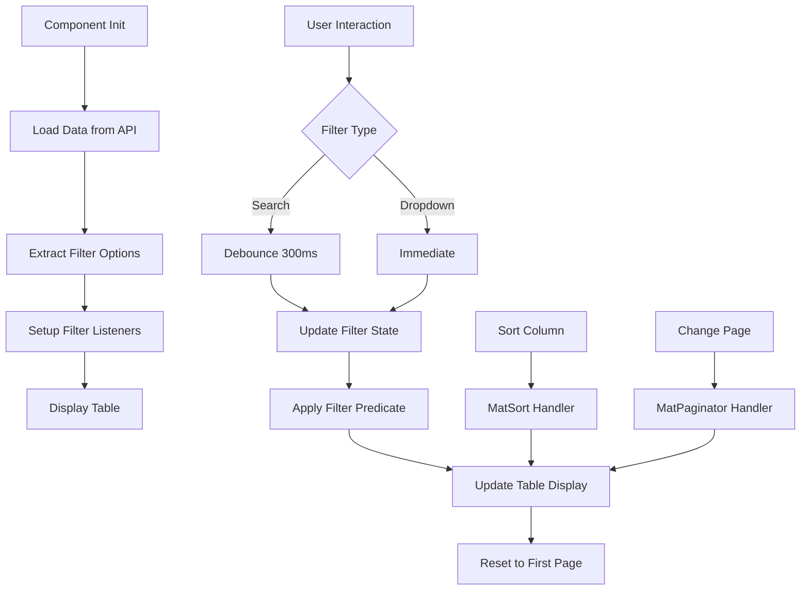

# Channels Table Component Architecture Plan

## Overview
Transform the channels component to display a comprehensive data table similar to the keywords and regions components, with sorting, filtering, and search capabilities.

## API Endpoint
- **URL**: `http://localhost:5090/api/Metrics/channels/all`
- **Method**: GET
- **Response Format**: Array of channel metrics objects

### Sample Response Data
```json
{
  "month": "2024-01",
  "channel": "Organic Search",
  "sessions": 18626,
  "signups": 575,
  "conversionRate": 3.09,
  "avgSessionDurationSec": 342,
  "bounceRate": 0.56,
  "pagesPerSession": 4.2
}
```

## Data Model Updates

### ChannelMetrics Interface Extension
Update the existing [`ChannelMetrics`](src/app/core/models/metrics.models.ts) interface to include all fields from the API:

```typescript
export interface ChannelMetrics {
  // Existing fields
  channel: string;
  sessions: number;
  conversions?: number;
  conversionRate: number;
  
  // New fields from /channels/all endpoint
  month?: string;              // Format: "YYYY-MM"
  signups?: number;            // Number of signups
  avgSessionDurationSec?: number;  // Average session duration in seconds
  bounceRate?: number;         // Bounce rate (0-1 decimal)
  pagesPerSession?: number;    // Average pages per session
  
  // Formatted display values (computed)
  formattedSessions?: string;
  formattedSignups?: string;
  formattedConversionRate?: string;
  formattedDuration?: string;
  formattedBounceRate?: string;
  formattedPagesPerSession?: string;
  
  [key: string]: any;
}
```

## Service Layer Updates

### MetricsService Enhancement
Add new method to [`MetricsService`](src/app/core/services/metrics.service.ts):

```typescript
/**
 * Get all channel metrics with monthly breakdown
 */
getAllChannelMetrics(): Observable<ChannelMetrics[]> {
  return this.http.get<ChannelMetrics[]>(`${this.baseUrl}/channels/all`);
}
```

## Component Architecture

### Component Structure
The [`ChannelsComponent`](src/app/features/channels/channels.component.ts) will follow the same pattern as [`KeywordsComponent`](src/app/features/keywords/keywords.component.ts) and [`RegionsComponent`](src/app/features/regions/regions.component.ts).

### Key Features

#### 1. Table Columns
Display all available data columns:
- **Month** - Time period (YYYY-MM format)
- **Channel** - Channel name (e.g., "Organic Search", "Paid Search")
- **Sessions** - Total sessions count
- **Signups** - Number of signups
- **Conversion Rate** - Percentage (formatted)
- **Avg Session Duration** - Time in minutes:seconds format
- **Bounce Rate** - Percentage (formatted)
- **Pages/Session** - Decimal number (formatted)

#### 2. Sorting
- All columns sortable using Material Sort
- Default sort: Sessions (descending)
- Implemented via `MatSort` directive

#### 3. Filtering System

##### Filter Controls
1. **Search Bar**
   - Global search across all text fields
   - Debounced input (300ms)
   - Clear button when text present
   - Icon: `search`

2. **Year Filter**
   - Dropdown with unique years from data
   - Options: "All Years", 2024, 2025, etc.
   - Icon: `calendar_today`

3. **Month Filter**
   - Dropdown with months 1-12
   - Options: "All Months", January, February, etc.
   - Icon: `date_range`

4. **Channel Filter**
   - Dropdown with unique channel names
   - Options: "All Channels", then dynamic list
   - Icon: `campaign`

5. **Reset Filters Button**
   - Clears all filters at once
   - Icon: `filter_alt_off`

##### Filter State Interface
```typescript
interface FilterState {
  search: string;
  year: string;
  month: string;
  channel: string;
}
```

#### 4. Data Processing

##### Time Period Filtering
Extract year and month from the `month` field (format: "YYYY-MM"):
- Parse year for year filter
- Parse month for month filter
- Support "All" option to show all records

##### Data Formatting
Format values for display:
- **Sessions/Signups**: Comma-separated numbers (e.g., "18,626")
- **Conversion Rate**: Percentage with 2 decimals (e.g., "3.09%")
- **Duration**: Convert seconds to "MM:SS" format (e.g., "5:42")
- **Bounce Rate**: Percentage with 2 decimals (e.g., "56.00%")
- **Pages/Session**: Decimal with 1 decimal place (e.g., "4.2")

#### 5. Pagination
- Material Paginator component
- Page size options: [10, 25, 50, 100]
- Default page size: 10
- Show first/last buttons

#### 6. Loading & Error States
- Loading spinner overlay during data fetch
- Error message with retry button
- Empty state when no data matches filters

## Component Implementation Details

### TypeScript Structure

```typescript
@Component({
  selector: 'app-channels',
  standalone: true,
  imports: [
    CommonModule,
    ReactiveFormsModule,
    MatTableModule,
    MatSortModule,
    MatPaginatorModule,
    MatFormFieldModule,
    MatInputModule,
    MatSelectModule,
    MatIconModule,
    MatButtonModule,
    MatProgressSpinnerModule
  ],
  templateUrl: './channels.component.html',
  styleUrls: ['./channels.component.css'],
  changeDetection: ChangeDetectionStrategy.Default
})
export class ChannelsComponent implements OnInit, AfterViewInit {
  // Table configuration
  displayedColumns: string[] = [
    'month',
    'channel',
    'sessions',
    'signups',
    'conversionRate',
    'avgSessionDurationSec',
    'bounceRate',
    'pagesPerSession'
  ];
  
  // Data source
  dataSource = new MatTableDataSource<ChannelMetrics>([]);
  
  // State
  loading = false;
  error: string | null = null;
  
  // Raw data for filtering
  private rawData: ChannelMetrics[] = [];
  
  // Filter options
  years: string[] = [];
  months: { value: string; label: string }[] = [];
  channels: string[] = [];
  
  // Form controls
  searchControl = new FormControl('');
  yearControl = new FormControl('all');
  monthControl = new FormControl('all');
  channelControl = new FormControl('all');
  
  // Filter state
  private filterState: FilterState = {
    search: '',
    year: 'all',
    month: 'all',
    channel: 'all'
  };
  
  // ViewChild references
  @ViewChild(MatSort) sort!: MatSort;
  @ViewChild(MatPaginator) paginator!: MatPaginator;
  
  // Lifecycle hooks
  ngOnInit(): void
  ngAfterViewInit(): void
  
  // Data loading
  loadChannelData(): void
  
  // Filter setup
  private setupFilterListeners(): void
  private createFilterPredicate(): (data: ChannelMetrics, filter: string) => boolean
  private applyFilters(): void
  private extractFilterOptions(data: ChannelMetrics[]): void
  
  // Formatting methods
  formatNumber(value: number | undefined | null): string
  formatPercentage(value: number | undefined | null): string
  formatDuration(seconds: number | undefined | null): string
  formatDecimal(value: number | undefined | null): string
  
  // Action methods
  clearSearch(): void
  resetFilters(): void
  retry(): void
}
```

### HTML Template Structure

```html
<div class="channels-container">
  <!-- Header -->
  <div class="header">
    <h1>Channel Performance</h1>
  </div>

  <!-- Loading overlay -->
  <div *ngIf="loading" class="loading-overlay">
    <mat-spinner></mat-spinner>
    <p>Loading channel data...</p>
  </div>

  <!-- Error state -->
  <div *ngIf="error && !loading" class="error-state">
    <mat-icon>error_outline</mat-icon>
    <p>{{ error }}</p>
    <button mat-raised-button color="primary" (click)="retry()">
      <mat-icon>refresh</mat-icon> Retry
    </button>
  </div>

  <!-- Content -->
  <div class="content" [class.hidden]="loading || error">
    
    <!-- Filters section -->
    <div class="filters-section">
      <!-- Search bar -->
      <mat-form-field class="search-field" appearance="outline">
        <mat-icon matIconPrefix>search</mat-icon>
        <input matInput [formControl]="searchControl" 
               placeholder="Search channels" 
               autocomplete="off">
        <button mat-icon-button matSuffix 
                *ngIf="searchControl.value" 
                (click)="clearSearch()">
          <mat-icon>close</mat-icon>
        </button>
      </mat-form-field>

      <!-- Filter controls -->
      <div class="filter-controls">
        <!-- Year filter -->
        <mat-form-field appearance="outline">
          <mat-label>Year</mat-label>
          <mat-select [formControl]="yearControl">
            <mat-option value="all">All Years</mat-option>
            <mat-option *ngFor="let year of years" [value]="year">
              {{ year }}
            </mat-option>
          </mat-select>
          <mat-icon matPrefix>calendar_today</mat-icon>
        </mat-form-field>

        <!-- Month filter -->
        <mat-form-field appearance="outline">
          <mat-label>Month</mat-label>
          <mat-select [formControl]="monthControl">
            <mat-option value="all">All Months</mat-option>
            <mat-option *ngFor="let month of months" [value]="month.value">
              {{ month.label }}
            </mat-option>
          </mat-select>
          <mat-icon matPrefix>date_range</mat-icon>
        </mat-form-field>

        <!-- Channel filter -->
        <mat-form-field appearance="outline">
          <mat-label>Channel</mat-label>
          <mat-select [formControl]="channelControl">
            <mat-option value="all">All Channels</mat-option>
            <mat-option *ngFor="let channel of channels" [value]="channel">
              {{ channel }}
            </mat-option>
          </mat-select>
          <mat-icon matPrefix>campaign</mat-icon>
        </mat-form-field>

        <!-- Reset button -->
        <button mat-stroked-button (click)="resetFilters()" class="reset-button">
          <mat-icon>filter_alt_off</mat-icon> Reset Filters
        </button>
      </div>
    </div>

    <!-- Results info -->
    <div class="results-info">
      <p>
        <strong>{{ dataSource.filteredData.length }}</strong>
        <span *ngIf="dataSource.filteredData.length !== dataSource.data.length">
          of {{ dataSource.data.length }}
        </span>
        records
      </p>
    </div>

    <!-- Table -->
    <div class="table-container">
      <table mat-table [dataSource]="dataSource" matSort 
             matSortActive="sessions" matSortDirection="desc" 
             class="channels-table">
        
        <!-- Column definitions -->
        <!-- Month, Channel, Sessions, Signups, etc. -->
        
        <!-- Header and rows -->
        <tr mat-header-row *matHeaderRowDef="displayedColumns; sticky: true"></tr>
        <tr mat-row *matRowDef="let row; columns: displayedColumns;" class="table-row"></tr>

        <!-- No data row -->
        <tr class="mat-row no-data-row" *matNoDataRow>
          <td class="mat-cell" [attr.colspan]="displayedColumns.length">
            <div class="no-data">
              <mat-icon>search_off</mat-icon>
              <p>No channels match your filters</p>
              <button mat-button color="primary" (click)="resetFilters()">
                Clear Filters
              </button>
            </div>
          </td>
        </tr>
      </table>
    </div>

    <!-- Paginator -->
    <mat-paginator [pageSizeOptions]="[10,25,50,100]" 
                   [pageSize]="10" 
                   showFirstLastButtons 
                   aria-label="Select page of channels">
    </mat-paginator>
  </div>
</div>
```

## CSS Styling

Follow the same styling pattern as keywords and regions components:
- Responsive layout
- Material Design theme integration
- Sticky table header
- Hover effects on rows
- Proper spacing and alignment
- Loading overlay styling
- Error state styling

Key CSS classes:
- `.channels-container` - Main container
- `.filters-section` - Filter controls area
- `.search-field` - Search input styling
- `.filter-controls` - Filter dropdowns layout
- `.table-container` - Scrollable table wrapper
- `.loading-overlay` - Loading state overlay
- `.error-state` - Error message styling
- `.no-data` - Empty state styling

## Data Flow Diagram



## Implementation Steps

1. **Update Data Model**
   - Extend ChannelMetrics interface in [`metrics.models.ts`](src/app/core/models/metrics.models.ts)
   - Add formatted field properties

2. **Update Service**
   - Add `getAllChannelMetrics()` method to [`MetricsService`](src/app/core/services/metrics.service.ts)
   - Test API endpoint connectivity

3. **Update Component TypeScript**
   - Import required Material modules
   - Add table configuration properties
   - Implement filter logic
   - Add formatting methods
   - Setup ViewChild references
   - Implement lifecycle hooks

4. **Create HTML Template**
   - Add loading/error states
   - Create filter section
   - Build Material table with all columns
   - Add pagination

5. **Add CSS Styling**
   - Copy base styles from keywords/regions
   - Customize for channels-specific needs
   - Ensure responsive design

6. **Testing**
   - Verify data loading
   - Test all filters independently
   - Test combined filters
   - Test sorting on all columns
   - Test pagination
   - Test search functionality
   - Verify formatting of all data types

## Key Considerations

### Performance
- Use `ChangeDetectionStrategy.Default` for reactive updates
- Debounce search input to reduce filter operations
- Use `trackBy` function for table rows if needed

### Accessibility
- Proper ARIA labels on form fields
- Keyboard navigation support
- Screen reader friendly

### Error Handling
- Display user-friendly error messages
- Provide retry mechanism
- Handle empty data states gracefully

### Data Consistency
- Ensure month format is consistent (YYYY-MM)
- Handle null/undefined values in formatting
- Validate data types from API

## Future Enhancements

Potential improvements for future iterations:
- Export table data to CSV/Excel
- Column visibility toggle
- Advanced filter combinations
- Date range picker for month selection
- Chart visualization toggle
- Comparison view (month-over-month)
- Drill-down details on row click
