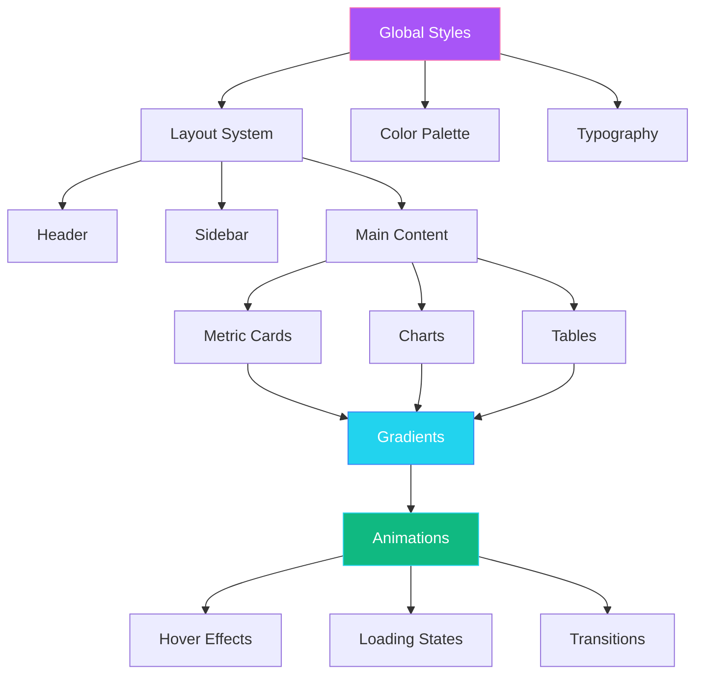

# Dark Theme Design System - Professional Dashboard

## 🎨 Design Overview

This document outlines the complete design system for transforming the Solveo Dashboard into a modern, polished dark-themed analytics platform with vibrant gradient accents and professional navigation.

---

## 📐 Layout Architecture

### Grid System
- **Gap spacing**: 24-32px between cards and sections
- **Responsive breakpoints**:
  - Desktop: 1200px+ (3-4 columns)
  - Tablet: 768-1199px (2 columns)
  - Mobile: <768px (1 column)
- **Container max-width**: 1600px
- **Padding**: 24-32px on desktop, 16-20px on mobile

### Card Design
- **Border radius**: 12-16px (rounded corners)
- **Box shadow**: `0 4px 12px rgba(0, 0, 0, 0.3)` (subtle depth)
- **Padding**: 16-24px internal spacing
- **Hover effect**: Lift with increased shadow
- **Transition**: 0.3s ease for smooth animations

---

## 🎨 Color Palette

### Background Colors
```css
--bg-primary: #1F213A;           /* Main background - dark blue/purple */
--bg-secondary: #1A1B2F;         /* Sidebar/darker sections */
--bg-card: #252740;              /* Card backgrounds */
--bg-card-hover: #2D2F4A;        /* Card hover state */
```

### Gradient Colors
```css
/* Primary Gradient - Metrics/Cards */
--gradient-primary: linear-gradient(135deg, #A855F7, #F472B6);
/* Purple to Pink - for metric cards, highlights */

/* Secondary Gradient - Charts/Bars */
--gradient-secondary: linear-gradient(135deg, #22D3EE, #3B82F6);
/* Cyan to Blue - for charts, progress bars */

/* Accent Gradient - Special elements */
--gradient-accent: linear-gradient(135deg, #10B981, #22D3EE);
/* Green to Cyan - for positive metrics */
```

### Text Colors
```css
--text-primary: #FFFFFF;         /* Main headings, important text */
--text-secondary: #D1D5DB;       /* Body text, labels */
--text-tertiary: #9CA3AF;        /* Subtle text, placeholders */
--text-muted: #6B7280;           /* Disabled, very subtle */
```

### Semantic Colors
```css
--color-success: #10B981;        /* Green - positive metrics */
--color-warning: #F59E0B;        /* Amber - warnings */
--color-error: #EF4444;          /* Red - errors, alerts */
--color-info: #22D3EE;           /* Cyan - information */
```

---

## 🔤 Typography

### Font Family
```css
font-family: 'Inter', 'Poppins', 'Roboto', -apple-system, BlinkMacSystemFont, sans-serif;
```

### Font Sizes & Weights
```css
/* Headings */
--font-h1: 28-32px, bold (700)
--font-h2: 24-28px, bold (700)
--font-h3: 18-22px, semibold (600)

/* Body */
--font-body-lg: 16-18px, regular (400)
--font-body: 14-16px, regular (400)
--font-body-sm: 12-14px, regular (400)

/* Numbers/Metrics */
--font-metric: 32-48px, bold (700)
--font-metric-sm: 24-32px, bold (700)

/* Labels */
--font-label: 12-14px, medium (500)
--font-label-sm: 11-12px, medium (500)
```

---

## 🧩 Component Specifications

### 1. Header (Sticky)
```
Structure:
┌─────────────────────────────────────────────────────┐
│ [Logo]                    [Search] [🔔] [👤]        │
└─────────────────────────────────────────────────────┘

Specifications:
- Position: sticky, top: 0, z-index: 100
- Height: 64px
- Background: #1A1B2F with subtle shadow
- Shadow: 0 2px 8px rgba(0, 0, 0, 0.2)
- Logo: Left aligned, 32px height
- Right section: Search bar + notification bell + user avatar
- Backdrop blur: 8px for modern effect
```

### 2. Sidebar Navigation (Collapsible)
```
Structure:
┌──────────────┐
│ [≡] Logo     │
├──────────────┤
│ 📊 Dashboard │ ← Active (gradient highlight)
│ 📈 Reports   │
│ 📺 Channels  │
│ 🎫 Tickets   │
│ 🔔 Alerts    │
│ ⚙️  Settings │
├──────────────┤
│ [Download]   │ ← Gradient button
└──────────────┘

Specifications:
- Width: 240px (expanded), 64px (collapsed)
- Background: #1A1B2F
- Border radius: 0 16px 16px 0
- Active link: Gradient background + subtle glow
- Hover: Background shift to #252740
- Icons: 20px, with 8px gap to text
- Transition: 0.3s ease for collapse/expand
- Box shadow: 2px 0 8px rgba(0, 0, 0, 0.2)
```

### 3. Metric Cards
```
Structure:
┌─────────────────────────┐
│ 📊 WEBSITE TRAFFIC      │ ← Icon + Label (uppercase)
│                         │
│ 1,234,567 ↗            │ ← Large number + trend
│                         │
│ [+12.5% MoM]           │ ← Growth badge
└─────────────────────────┘

Specifications:
- Background: Gradient overlay on dark card
- Border radius: 16px
- Padding: 20-24px
- Shadow: 0 4px 12px rgba(0, 0, 0, 0.3)
- Hover: translateY(-4px) + increased shadow
- Number size: 36-48px, bold
- Label: 12-14px, uppercase, light gray
- Growth badge: Rounded pill with background color
```

### 4. Line Charts
```
Specifications:
- Background: Dark card (#252740)
- Grid lines: Subtle (#374151), 1px
- Line: 3px width, smooth curves (tension: 0.4)
- Gradient fill: Under curve, 20% opacity
- Points: 6px circles on hover
- Tooltip: Dark background, rounded, shadow
- Axes labels: 12px, #9CA3AF
- Max/Min markers: Accent circle + label
```

### 5. Bar Charts
```
Specifications:
- Bar fill: Gradient (secondary)
- Border radius: 8px (top corners only)
- Bar width: 60% of category width
- Hover: Brightness increase + subtle glow
- Grid lines: Horizontal only, subtle
- Animation: Slide up on load (0.6s ease-out)
```

### 6. Pie/Donut Charts
```
Specifications:
- Arc fill: Gradient per segment
- Border: 2px gap between segments
- Center text: Large metric + label
- Labels: Outside with leader lines
- Hover: Segment pull-out effect
- Animation: Rotate in on load
```

### 7. Data Tables
```
Structure:
┌─────────────────────────────────────────┐
│ Top Keywords                            │
├─────────┬──────────┬──────────┬─────────┤
│ Keyword │ Searches │ CTR      │ Conv.   │ ← Header
├─────────┼──────────┼──────────┼─────────┤
│ angular │ 12,345   │ 3.2%     │ 156     │ ← Row (hover)
│ react   │ 10,234   │ 2.8%     │ 142     │
└─────────┴──────────┴──────────┴─────────┘

Specifications:
- Background: Dark card
- Header: Slightly lighter background (#2D2F4A)
- Header text: 12-14px, semibold, uppercase
- Row padding: 12-16px
- Row hover: Background #2D2F4A + subtle glow
- Border: 1px solid #374151 (subtle)
- Alternating rows: Optional subtle difference
- Sort icons: Cyan color on active column
```

---

## ✨ Micro-Animations

### Hover Effects
```css
/* Cards */
.card:hover {
  transform: translateY(-4px);
  box-shadow: 0 8px 24px rgba(0, 0, 0, 0.4);
  transition: all 0.3s ease;
}

/* Buttons */
.button:hover {
  transform: scale(1.05);
  box-shadow: 0 4px 16px rgba(168, 85, 247, 0.4);
  transition: all 0.2s ease;
}

/* Table Rows */
tr:hover {
  background: #2D2F4A;
  box-shadow: inset 0 0 0 1px rgba(168, 85, 247, 0.2);
  transition: all 0.2s ease;
}
```

### Loading States
```css
/* Skeleton loader */
@keyframes shimmer {
  0% { background-position: -1000px 0; }
  100% { background-position: 1000px 0; }
}

.skeleton {
  background: linear-gradient(
    90deg,
    #252740 0%,
    #2D2F4A 50%,
    #252740 100%
  );
  background-size: 1000px 100%;
  animation: shimmer 2s infinite;
}
```

### Metric Updates
```css
/* Fade in new values */
@keyframes fadeIn {
  from { opacity: 0; transform: translateY(-10px); }
  to { opacity: 1; transform: translateY(0); }
}

.metric-value {
  animation: fadeIn 0.4s ease-out;
}
```

### Chart Animations
```javascript
// Chart.js configuration
animation: {
  duration: 800,
  easing: 'easeInOutQuart',
  onComplete: () => {
    // Highlight max/min points
  }
}
```

---

## 📱 Responsive Design

### Breakpoints
```css
/* Desktop First Approach */
@media (max-width: 1200px) {
  /* Tablet landscape */
  .metrics-grid { grid-template-columns: repeat(2, 1fr); }
  .sidebar { width: 64px; } /* Collapsed by default */
}

@media (max-width: 768px) {
  /* Tablet portrait / Mobile */
  .metrics-grid { grid-template-columns: 1fr; }
  .sidebar { transform: translateX(-100%); } /* Hidden */
  .header { padding: 12px 16px; }
  .card { padding: 16px; }
}

@media (max-width: 480px) {
  /* Small mobile */
  .metric-value { font-size: 28px; }
  .chart-height { height: 250px; }
}
```

---

## 🎯 Implementation Priority

### Phase 1: Foundation (Critical)
1. Global dark theme styles (colors, typography)
2. Card component base styling
3. Layout grid system

### Phase 2: Navigation (High Priority)
4. Sidebar navigation component
5. Sticky header component
6. Responsive navigation behavior

### Phase 3: Components (High Priority)
7. Metric cards with gradients
8. Chart styling (line, bar, pie)
9. Data table styling

### Phase 4: Polish (Medium Priority)
10. Micro-animations and transitions
11. Hover effects
12. Loading states

### Phase 5: Refinement (Low Priority)
13. Accessibility improvements
14. Performance optimization
15. Cross-browser testing

---

## 🔧 Technical Implementation Notes

### CSS Variables Setup
Create a centralized CSS variables file for easy theming:
```css
/* src/styles/variables.css */
:root {
  /* All color, spacing, and typography variables */
}
```

### Component Structure
```
src/app/
├── core/
│   └── layout/
│       ├── header/
│       └── sidebar/
├── shared/
│   └── components/
│       ├── metric-card/
│       ├── line-chart/
│       ├── bar-chart/
│       └── data-table/
└── features/
    └── dashboard/
```

### Angular Material Theming
```typescript
// Custom dark theme for Angular Material
import { MatThemeModule } from '@angular/material';

const darkTheme = {
  primary: '#A855F7',
  accent: '#22D3EE',
  warn: '#EF4444',
  background: '#1F213A',
  surface: '#252740'
};
```

---

## 📊 Design System Diagram



---

## ✅ Quality Checklist

- [ ] All colors use CSS variables for easy theming
- [ ] Consistent spacing using 4px/8px grid system
- [ ] All interactive elements have hover states
- [ ] Loading states for all async content
- [ ] Responsive design tested on all breakpoints
- [ ] Accessibility: WCAG AA contrast ratios
- [ ] Smooth animations (60fps)
- [ ] Cross-browser compatibility (Chrome, Firefox, Safari, Edge)
- [ ] Dark mode optimized (no pure white/black)
- [ ] Gradient performance optimized

---

## 🎨 Visual Reference

### Color Swatches
- **Background**: `#1F213A` ████████
- **Card**: `#252740` ████████
- **Primary Gradient**: `#A855F7 → #F472B6` ████████
- **Secondary Gradient**: `#22D3EE → #3B82F6` ████████
- **Success**: `#10B981` ████████
- **Text Primary**: `#FFFFFF` ████████
- **Text Secondary**: `#D1D5DB` ████████

---

## 📝 Notes

- Use `backdrop-filter: blur(8px)` for modern glass-morphism effects
- Implement CSS Grid for layout, Flexbox for component internals
- Use CSS custom properties for dynamic theming
- Optimize gradients with `will-change` for performance
- Consider prefers-reduced-motion for accessibility
- Test with real data to ensure readability

---

**Last Updated**: 2026-01-28
**Version**: 1.0
**Status**: Ready for Implementation
