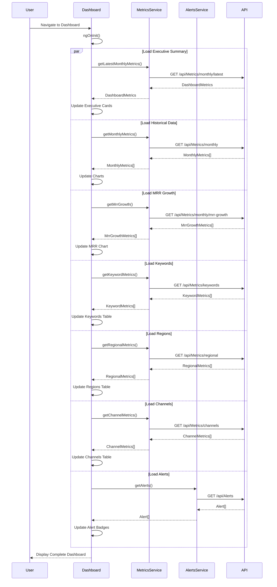
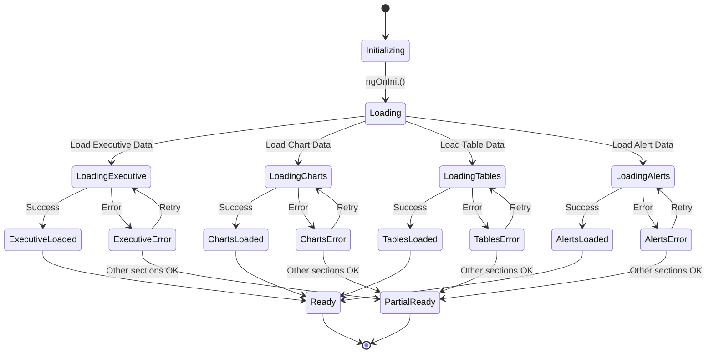
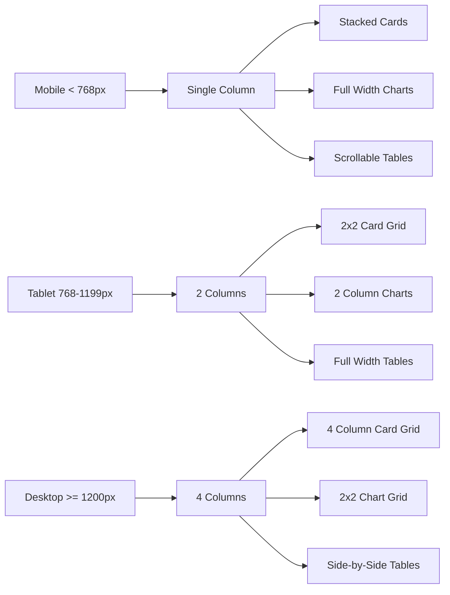
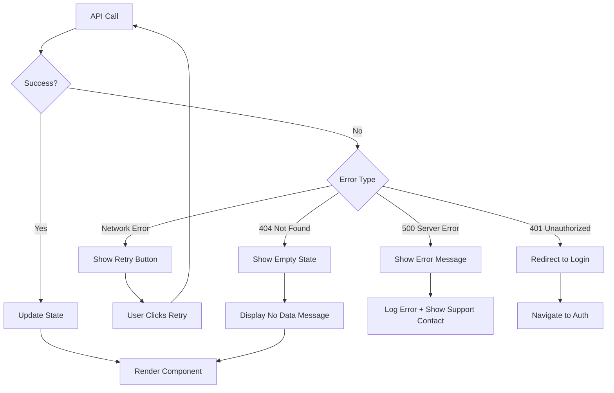
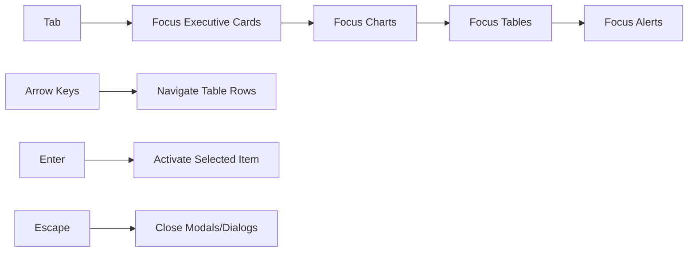

# Dashboard Component Hierarchy & Data Flow

## Component Tree Structure

```mermaid
graph TD
    A[DashboardComponent] --> B[Executive Summary Section]
    A --> C[Charts Section]
    A --> D[Funnel Section]
    A --> E[Tables Section]
    A --> F[Geographic Section]
    A --> G[Alerts Section]
    A --> H[Debug Section]
    
    B --> B1[MetricCardComponent - MRR]
    B --> B2[MetricCardComponent - Traffic]
    B --> B3[MetricCardComponent - Conversions]
    B --> B4[MetricCardComponent - Conversion Rate]
    B --> B5[MetricCardComponent - Churn Rate]
    
    C --> C1[LineChartComponent - MRR Trend]
    C --> C2[LineChartComponent - Traffic Trend]
    C --> C3[LineChartComponent - Conversions Trend]
    C --> C4[LineChartComponent - Conversion Rate Trend]
    
    D --> D1[FunnelChartComponent]
    
    E --> E1[DataTableComponent - Keywords]
    E --> E2[DataTableComponent - Regions]
    E --> E3[DataTableComponent - Channels]
    
    F --> F1[DataTableComponent - Geographic Hierarchy]
    
    G --> G1[AlertBadgeComponent - MRR Alert]
    G --> G2[AlertBadgeComponent - Traffic Alert]
    G --> G3[AlertBadgeComponent - Conversion Alert]
    G --> G4[AlertBadgeComponent - Churn Alert]
```



## Data Flow Diagram



## State Management Flow



## Component Communication Patterns

### 1. Parent to Child (Input Binding)

```typescript
// Dashboard Component (Parent)
<app-metric-card
  [title]="'MRR'"
  [value]="latestMetrics?.latestMrr"
  [growth]="latestMetrics?.growthPercentageMoM"
  [icon]="'attach_money'"
  [loading]="executiveSummary.loading">
</app-metric-card>
```

### 2. Child to Parent (Output Binding)

```typescript
// DataTable Component (Child)
@Output() rowClick = new EventEmitter<any>();

// Dashboard Component (Parent)
<app-data-table
  [data]="keywordMetrics"
  (rowClick)="onKeywordClick($event)">
</app-data-table>
```

### 3. Service-Based Communication

```typescript
// Shared service for cross-component communication
@Injectable({ providedIn: 'root' })
export class DashboardStateService {
  private selectedRegionSubject = new BehaviorSubject<string | null>(null);
  selectedRegion$ = this.selectedRegionSubject.asObservable();
  
  selectRegion(region: string): void {
    this.selectedRegionSubject.next(region);
  }
}
```

## Responsive Layout Breakpoints



## Loading State Strategy

### Progressive Loading

```mermaid
gantt
    title Dashboard Loading Timeline
    dateFormat X
    axisFormat %Ls
    
    section Critical
    Executive Cards    :0, 500ms
    Alerts            :0, 500ms
    
    section Important
    MRR Chart         :500ms, 800ms
    Traffic Chart     :500ms, 800ms
    
    section Secondary
    Keywords Table    :800ms, 1200ms
    Regions Table     :800ms, 1200ms
    Channels Table    :800ms, 1200ms
    
    section Optional
    Debug Section     :1200ms, 1500ms
```

### Loading State Hierarchy

1. **Skeleton Loaders** (0-500ms)
   - Show placeholder cards
   - Display chart containers
   - Show table headers

2. **Partial Content** (500-1000ms)
   - Executive cards populated
   - Alerts displayed
   - Charts start rendering

3. **Full Content** (1000-2000ms)
   - All charts rendered
   - Tables populated
   - Interactive features enabled

4. **Enhanced Features** (2000ms+)
   - Animations complete
   - Tooltips enabled
   - Advanced interactions ready

## Error Handling Strategy



## Performance Optimization Strategy

### 1. Change Detection Optimization

```typescript
@Component({
  selector: 'app-dashboard',
  changeDetection: ChangeDetectionStrategy.OnPush,
  // ...
})
export class DashboardComponent {
  // Use OnPush to reduce change detection cycles
}
```

### 2. Observable Optimization

```typescript
// Share API calls across multiple subscribers
private monthlyMetrics$ = this.metricsService
  .getMonthlyMetrics()
  .pipe(
    shareReplay(1),
    catchError(error => {
      console.error('Error loading metrics:', error);
      return of([]);
    })
  );
```

### 3. Lazy Loading Strategy

```typescript
// Defer loading of non-critical components
@Component({
  selector: 'app-data-table',
  template: `
    <div *ngIf="visible$ | async">
      <!-- Table content -->
    </div>
  `
})
export class DataTableComponent implements OnInit {
  visible$ = new Observable(observer => {
    // Use Intersection Observer to detect when component is in viewport
    const intersectionObserver = new IntersectionObserver(entries => {
      if (entries[0].isIntersecting) {
        observer.next(true);
        intersectionObserver.disconnect();
      }
    });
    intersectionObserver.observe(this.elementRef.nativeElement);
  });
}
```

## Accessibility Features

### Keyboard Navigation



### Screen Reader Support

- ARIA labels on all interactive elements
- Live regions for dynamic content updates
- Semantic HTML structure
- Alt text for visual indicators

### Color Contrast

- All text meets WCAG AA standards (4.5:1 ratio)
- Color is not the only indicator (use icons + text)
- High contrast mode support

## Testing Strategy

### Unit Tests

```typescript
describe('DashboardComponent', () => {
  it('should load executive summary on init', () => {
    // Test executive summary loading
  });
  
  it('should handle API errors gracefully', () => {
    // Test error handling
  });
  
  it('should calculate funnel percentages correctly', () => {
    // Test funnel calculations
  });
});
```

### Integration Tests

```typescript
describe('Dashboard Integration', () => {
  it('should load all sections in parallel', () => {
    // Test parallel data loading
  });
  
  it('should update charts when data changes', () => {
    // Test reactive updates
  });
});
```

### E2E Tests (Future)

```typescript
describe('Dashboard E2E', () => {
  it('should display dashboard with all sections', () => {
    cy.visit('/dashboard');
    cy.get('.executive-cards').should('be.visible');
    cy.get('.charts-section').should('be.visible');
    cy.get('.tables-section').should('be.visible');
  });
});
```

## Deployment Considerations

### Build Optimization

```bash
# Production build with optimizations
ng build --configuration production

# Analyze bundle size
ng build --stats-json
npx webpack-bundle-analyzer dist/stats.json
```

### Environment Configuration

```typescript
// environment.prod.ts
export const environment = {
  production: true,
  apiUrl: 'https://api.production.com/api',
  alertThresholds: {
    mrrDropThreshold: -5,
    trafficDropThreshold: -10,
    lowConversionThreshold: 2,
    highChurnThreshold: 5
  },
  enableDebugSection: false
};
```

### Performance Metrics

- **First Contentful Paint (FCP):** <1.5s
- **Largest Contentful Paint (LCP):** <2.5s
- **Time to Interactive (TTI):** <3.5s
- **Cumulative Layout Shift (CLS):** <0.1

---

**Document Status:** Complete  
**Last Updated:** 2026-01-27  
**Version:** 1.0
