# Dashboard Implementation Flow Diagram

## Implementation Workflow

```mermaid
graph TD
    A[Start: Review Implementation Guide] --> B{Phase 1: Executive Summary}
    B --> C[Update metrics-grid CSS]
    C --> D[Add Windows logo layout]
    D --> E[Add responsive breakpoints]
    
    E --> F{Phase 2: Dashboard Header}
    F --> G[Center align header]
    G --> H[Add gradient accent bar]
    H --> I[Apply gradient text effect]
    
    I --> J{Phase 3: Section Titles}
    J --> K[Add arrow icon prefix]
    K --> L[Add gradient underline]
    
    L --> M{Phase 4: Performance Trends}
    M --> N[Reorder charts in HTML]
    N --> O[Update chart colors]
    O --> P[Update charts-grid CSS]
    
    P --> Q{Phase 5: Detailed Metrics}
    Q --> R[Update tables-grid CSS]
    R --> S[Add calculateTableRows method]
    S --> T[Update loadRegions/loadChannels]
    T --> U[Update Keywords table HTML]
    
    U --> V{Phase 6: Active Alerts}
    V --> W[Add smart tab logic to TS]
    W --> X[Remove show/hide logic]
    X --> Y[Update alerts HTML]
    Y --> Z[Add alerts tabs CSS]
    Z --> AA[Update alert-badge CSS]
    
    AA --> AB[Testing & Verification]
    AB --> AC[Complete]
    
    style A fill:#e1f5ff
    style AC fill:#c8e6c9
    style B fill:#fff9c4
    style F fill:#fff9c4
    style J fill:#fff9c4
    style M fill:#ffe0b2
    style Q fill:#ffe0b2
    style V fill:#ffccbc
    style AB fill:#f8bbd0
```

## Component Dependency Map

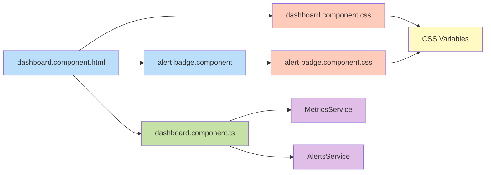

## Phase Dependencies

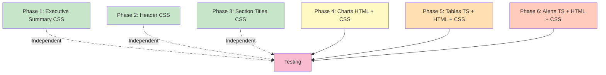

## File Modification Sequence

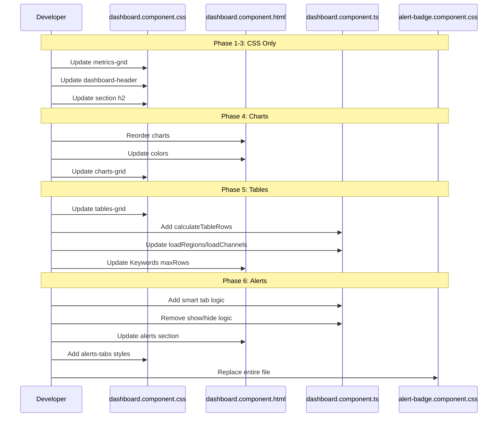

## Risk vs Complexity Matrix

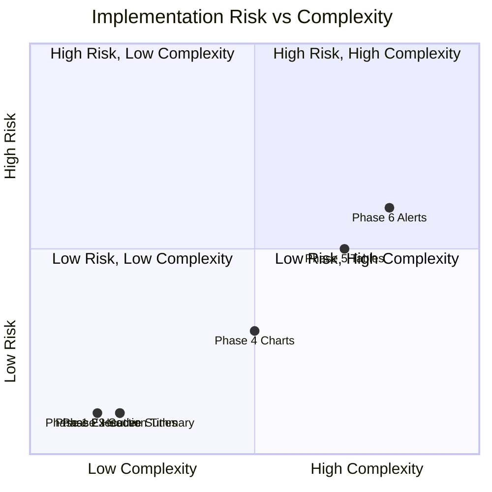

## Testing Flow

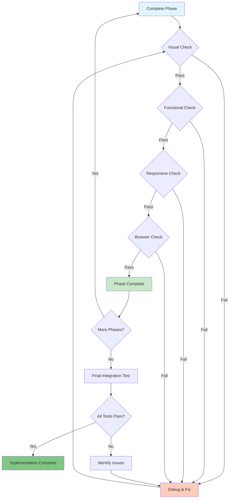

## Data Flow for Dynamic Features

### Phase 5: Dynamic Table Heights

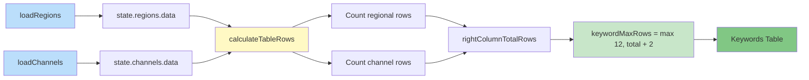

### Phase 6: Smart Alert Tabs

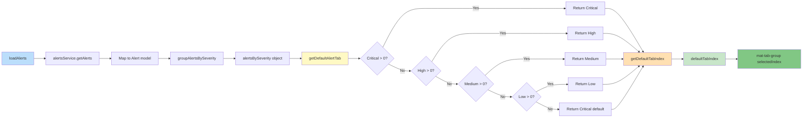

## Rollback Strategy

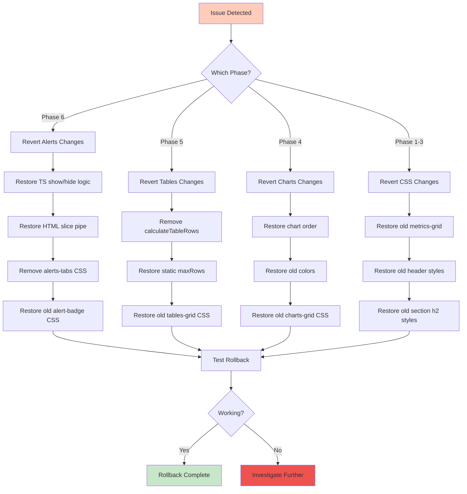

## Success Metrics

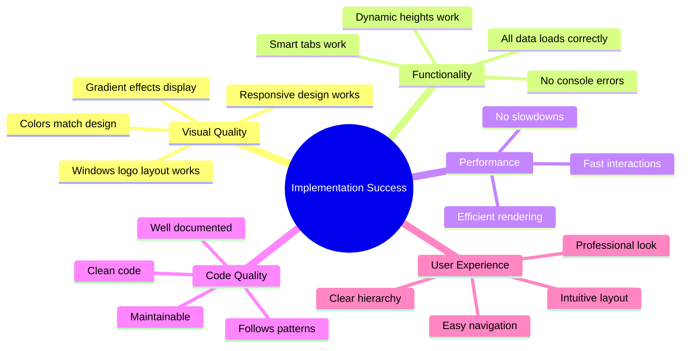

## Timeline Estimate

```mermaid
gantt
    title Implementation Timeline
    dateFormat HH:mm
    axisFormat %H:%M
    
    section Phase 1-3
    Executive Summary CSS    :p1, 00:00, 30m
    Header CSS              :p2, after p1, 20m
    Section Titles CSS      :p3, after p2, 15m
    
    section Phase 4
    Reorder Charts HTML     :p4, after p3, 20m
    Update Charts CSS       :p5, after p4, 25m
    
    section Phase 5
    Tables CSS              :p6, after p5, 30m
    Tables TypeScript       :p7, after p6, 40m
    Tables HTML             :p8, after p7, 15m
    
    section Phase 6
    Alerts TypeScript       :p9, after p8, 45m
    Alerts HTML             :p10, after p9, 30m
    Alerts CSS              :p11, after p10, 35m
    Alert Badge CSS         :p12, after p11, 20m
    
    section Testing
    Visual Testing          :t1, after p12, 30m
    Functional Testing      :t2, after t1, 30m
    Responsive Testing      :t3, after t2, 20m
    Browser Testing         :t4, after t3, 20m
```

**Note:** Timeline is approximate and assumes no major issues. Actual time may vary based on debugging needs and testing thoroughness.

---

## Key Takeaways

1. **Phases 1-3** are low-risk CSS-only changes that can be done quickly
2. **Phase 4** involves HTML reordering but is straightforward
3. **Phase 5** adds dynamic logic but has good fallbacks
4. **Phase 6** is the most complex with multiple file changes
5. Each phase can be tested independently
6. Rollback is possible at any stage
7. Total implementation time: approximately 6-7 hours including testing

---

## Next Actions

After reviewing this plan:

1. **Confirm approach** with stakeholders
2. **Set up development environment** for testing
3. **Create feature branch** for implementation
4. **Begin Phase 1** implementation
5. **Test incrementally** after each phase
6. **Document any deviations** from the plan
7. **Prepare for code review** after completion
