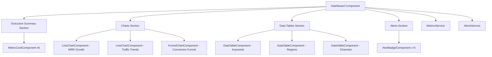

# Dashboard Integration Plan - Complete Implementation Guide

## Overview

This document provides a complete implementation plan for integrating the shared components into the dashboard. The current dashboard uses hardcoded cards and raw JSON display. This plan will transform it into a fully functional, responsive dashboard using reusable components.

## Current State Analysis

### What Exists
- ✅ Basic dashboard component with API integration
- ✅ MetricsService with all necessary API endpoints
- ✅ AlertsService with alert endpoints
- ✅ Basic models (MonthlyMetrics, MrrGrowthMetrics, Alert, etc.)
- ✅ Hardcoded metric cards showing: websiteTraffic, paidConversions, trialToPaidPercentage, latestMrr
- ✅ Basic MRR growth list display

### What's Missing
- ❌ Shared components (MetricCard, LineChart, FunnelChart, DataTable, AlertBadge)
- ❌ Extended dashboard models for funnel, charts, and tables
- ❌ Responsive grid layout
- ❌ Comprehensive loading states per section
- ❌ Integration of keywords, regions, channels data
- ❌ Alert display
- ❌ Chart.js and Angular Material dependencies

## Architecture Overview



## Implementation Steps

### Step 1: Install Dependencies

```bash
npm install ng2-charts chart.js @angular/material @angular/cdk
```

### Step 2: Create Extended Dashboard Models

**File:** `src/app/core/models/dashboard.models.ts`

This file extends the existing models with dashboard-specific interfaces for better type safety and data transformation.

### Step 3: Create Shared Components

Create 5 reusable components in `src/app/shared/components/`:

1. **MetricCardComponent** - Display key metrics with icons, trends, and growth indicators
2. **LineChartComponent** - Render time-series data using Chart.js
3. **FunnelChartComponent** - Visualize conversion funnel stages
4. **DataTableComponent** - Display tabular data with sorting and formatting
5. **AlertBadgeComponent** - Show alerts with severity indicators

### Step 4: Update Dashboard Component

Transform the dashboard to use shared components with:
- Section-based loading states
- Comprehensive error handling
- Responsive grid layout
- All API data properly bound

### Step 5: Implement Responsive Layout

Use CSS Grid for a mobile-first responsive design:
- Desktop: Multi-column grid
- Tablet: 2-column layout
- Mobile: Single column stack

## Detailed Implementation

### 1. Dashboard Models

```typescript
// src/app/core/models/dashboard.models.ts

import { MonthlyMetrics } from './metrics.models';

/**
 * Extended metrics interface for dashboard-specific fields
 */
export interface DashboardMetrics extends MonthlyMetrics {
  // Executive Summary Fields
  latestMrr: number;
  growthPercentageMoM: number;
  websiteTraffic: number;
  paidConversions: number;
  trialToPaidPercentage: number;
  churnRate: number;
  
  // Funnel Fields
  uniqueSignups: number;
  trialsStarted: number;
}

/**
 * Funnel stage data
 */
export interface FunnelData {
  stage: string;
  value: number;
  percentage: number;
  color?: string;
}

/**
 * Generic chart data point
 */
export interface ChartDataPoint {
  label: string;
  value: number;
}

/**
 * Table column definition
 */
export interface TableColumn {
  key: string;
  label: string;
  sortable?: boolean;
  type?: 'text' | 'number' | 'currency' | 'percentage';
  format?: (value: any) => string;
}

/**
 * Dashboard section state for granular loading/error handling
 */
export interface SectionState<T> {
  loading: boolean;
  error: string | null;
  data: T | null;
}

/**
 * Complete dashboard state
 */
export interface DashboardState {
  executiveSummary: SectionState<DashboardMetrics>;
  mrrGrowth: SectionState<ChartDataPoint[]>;
  trafficTrends: SectionState<ChartDataPoint[]>;
  conversionFunnel: SectionState<FunnelData[]>;
  keywords: SectionState<any[]>;
  regions: SectionState<any[]>;
  channels: SectionState<any[]>;
  alerts: SectionState<any[]>;
}
```

**Update:** `src/app/core/models/index.ts`
```typescript
export * from './dashboard.models';
```

### 2. Shared Components

#### 2.1 MetricCardComponent

**Purpose:** Display individual metrics with formatting, icons, trends, and growth indicators.

**File:** `src/app/shared/components/metric-card/metric-card.component.ts`

```typescript
import { Component, Input, ChangeDetectionStrategy } from '@angular/core';
import { CommonModule } from '@angular/common';
import { MatCardModule } from '@angular/material/card';
import { MatIconModule } from '@angular/material/icon';

@Component({
  selector: 'app-metric-card',
  standalone: true,
  imports: [CommonModule, MatCardModule, MatIconModule],
  templateUrl: './metric-card.component.html',
  styleUrls: ['./metric-card.component.css'],
  changeDetection: ChangeDetectionStrategy.OnPush
})
export class MetricCardComponent {
  @Input() title: string = '';
  @Input() value: number | string | null = null;
  @Input() growth?: number;
  @Input() icon?: string;
  @Input() loading: boolean = false;
  @Input() trend?: 'up' | 'down' | 'neutral';
  @Input() format: 'number' | 'currency' | 'percentage' = 'number';
  @Input() alert?: boolean = false;

  get formattedValue(): string {
    if (this.value === null || this.value === undefined) return '-';
    
    switch (this.format) {
      case 'currency':
        return `$${Number(this.value).toLocaleString('en-US', { minimumFractionDigits: 2, maximumFractionDigits: 2 })}`;
      case 'percentage':
        return `${Number(this.value).toFixed(2)}%`;
      default:
        return Number(this.value).toLocaleString('en-US');
    }
  }

  get growthClass(): string {
    if (!this.growth) return '';
    return this.growth >= 0 ? 'positive' : 'negative';
  }

  get trendIcon(): string {
    if (!this.trend) return '';
    switch (this.trend) {
      case 'up': return 'trending_up';
      case 'down': return 'trending_down';
      default: return 'trending_flat';
    }
  }
}
```

**File:** `src/app/shared/components/metric-card/metric-card.component.html`

```html
<mat-card [class.alert]="alert" [class.loading]="loading">
  <mat-card-header>
    <mat-card-title>
      <mat-icon *ngIf="icon">{{ icon }}</mat-icon>
      <span>{{ title }}</span>
    </mat-card-title>
  </mat-card-header>
  
  <mat-card-content>
    <div class="metric-value" *ngIf="!loading">
      {{ formattedValue }}
      <mat-icon *ngIf="trend" [class]="trend">{{ trendIcon }}</mat-icon>
    </div>
    
    <div class="skeleton" *ngIf="loading"></div>
    
    <div class="growth" *ngIf="growth !== undefined && !loading" [class]="growthClass">
      <span>{{ growth >= 0 ? '+' : '' }}{{ growth | number:'1.2-2' }}%</span>
      <span class="growth-label">vs last month</span>
    </div>
  </mat-card-content>
</mat-card>
```

**File:** `src/app/shared/components/metric-card/metric-card.component.css`

```css
mat-card {
  height: 100%;
  transition: transform 0.2s, box-shadow 0.2s;
}

mat-card:hover {
  transform: translateY(-2px);
  box-shadow: 0 4px 8px rgba(0,0,0,0.15);
}

mat-card.alert {
  border-left: 4px solid #f44336;
}

mat-card-header {
  margin-bottom: 16px;
}

mat-card-title {
  display: flex;
  align-items: center;
  gap: 8px;
  font-size: 14px;
  color: #666;
  text-transform: uppercase;
  font-weight: 500;
}

mat-card-title mat-icon {
  font-size: 20px;
  width: 20px;
  height: 20px;
}

.metric-value {
  font-size: 36px;
  font-weight: bold;
  color: #333;
  display: flex;
  align-items: center;
  gap: 8px;
  margin-bottom: 8px;
}

.metric-value mat-icon {
  font-size: 32px;
  width: 32px;
  height: 32px;
}

.metric-value mat-icon.up {
  color: #4caf50;
}

.metric-value mat-icon.down {
  color: #f44336;
}

.growth {
  display: flex;
  flex-direction: column;
  gap: 4px;
  padding: 8px 12px;
  border-radius: 4px;
  font-size: 14px;
  font-weight: 600;
  width: fit-content;
}

.growth.positive {
  background-color: #e8f5e9;
  color: #2e7d32;
}

.growth.negative {
  background-color: #ffebee;
  color: #c62828;
}

.growth-label {
  font-size: 11px;
  font-weight: normal;
  opacity: 0.8;
}

.skeleton {
  height: 36px;
  background: linear-gradient(90deg, #f0f0f0 25%, #e0e0e0 50%, #f0f0f0 75%);
  background-size: 200% 100%;
  animation: loading 1.5s infinite;
  border-radius: 4px;
}

@keyframes loading {
  0% { background-position: 200% 0; }
  100% { background-position: -200% 0; }
}

@media (max-width: 768px) {
  .metric-value {
    font-size: 28px;
  }
}
```

#### 2.2 LineChartComponent

**Purpose:** Render time-series data using Chart.js with responsive design.

**File:** `src/app/shared/components/line-chart/line-chart.component.ts`

```typescript
import { Component, Input, OnChanges, SimpleChanges, ChangeDetectionStrategy } from '@angular/core';
import { CommonModule } from '@angular/common';
import { BaseChartDirective } from 'ng2-charts';
import { ChartConfiguration, ChartType } from 'chart.js';

@Component({
  selector: 'app-line-chart',
  standalone: true,
  imports: [CommonModule, BaseChartDirective],
  templateUrl: './line-chart.component.html',
  styleUrls: ['./line-chart.component.css'],
  changeDetection: ChangeDetectionStrategy.OnPush
})
export class LineChartComponent implements OnChanges {
  @Input() data: any[] = [];
  @Input() labelKey: string = 'label';
  @Input() valueKey: string = 'value';
  @Input() title: string = '';
  @Input() color: string = '#3f51b5';
  @Input() loading: boolean = false;

  public lineChartType: ChartType = 'line';
  public lineChartData: ChartConfiguration['data'] = {
    datasets: [],
    labels: []
  };

  public lineChartOptions: ChartConfiguration['options'] = {
    responsive: true,
    maintainAspectRatio: true,
    aspectRatio: 2,
    plugins: {
      legend: {
        display: true,
        position: 'top'
      },
      tooltip: {
        mode: 'index',
        intersect: false
      }
    },
    scales: {
      x: {
        display: true,
        grid: {
          display: false
        }
      },
      y: {
        display: true,
        beginAtZero: true,
        grid: {
          color: 'rgba(0, 0, 0, 0.05)'
        }
      }
    }
  };

  ngOnChanges(changes: SimpleChanges): void {
    if (changes['data'] && this.data) {
      this.updateChartData();
    }
  }

  private updateChartData(): void {
    const labels = this.data.map(item => item[this.labelKey]);
    const values = this.data.map(item => item[this.valueKey]);

    this.lineChartData = {
      labels: labels,
      datasets: [
        {
          data: values,
          label: this.title,
          borderColor: this.color,
          backgroundColor: `${this.color}20`,
          fill: true,
          tension: 0.4,
          pointRadius: 4,
          pointHoverRadius: 6
        }
      ]
    };
  }
}
```

**File:** `src/app/shared/components/line-chart/line-chart.component.html`

```html
<div class="chart-container">
  <h3 *ngIf="title">{{ title }}</h3>
  
  <div class="chart-wrapper" *ngIf="!loading && data.length > 0">
    <canvas baseChart
      [type]="lineChartType"
      [data]="lineChartData"
      [options]="lineChartOptions">
    </canvas>
  </div>
  
  <div class="skeleton" *ngIf="loading"></div>
  
  <div class="no-data" *ngIf="!loading && data.length === 0">
    <p>No data available</p>
  </div>
</div>
```

**File:** `src/app/shared/components/line-chart/line-chart.component.css`

```css
.chart-container {
  background: white;
  border: 1px solid #ddd;
  border-radius: 8px;
  padding: 20px;
  height: 100%;
}

h3 {
  margin: 0 0 16px 0;
  color: #333;
  font-size: 18px;
  font-weight: 500;
}

.chart-wrapper {
  position: relative;
  height: 300px;
}

.skeleton {
  height: 300px;
  background: linear-gradient(90deg, #f0f0f0 25%, #e0e0e0 50%, #f0f0f0 75%);
  background-size: 200% 100%;
  animation: loading 1.5s infinite;
  border-radius: 4px;
}

@keyframes loading {
  0% { background-position: 200% 0; }
  100% { background-position: -200% 0; }
}

.no-data {
  height: 300px;
  display: flex;
  align-items: center;
  justify-content: center;
  color: #999;
}

@media (max-width: 768px) {
  .chart-wrapper {
    height: 250px;
  }
}
```

#### 2.3 FunnelChartComponent

**Purpose:** Visualize conversion funnel with percentage drop-off between stages.

**File:** `src/app/shared/components/funnel-chart/funnel-chart.component.ts`

```typescript
import { Component, Input, OnChanges, SimpleChanges, ChangeDetectionStrategy } from '@angular/core';
import { CommonModule } from '@angular/common';
import { FunnelData } from '../../../core/models';

@Component({
  selector: 'app-funnel-chart',
  standalone: true,
  imports: [CommonModule],
  templateUrl: './funnel-chart.component.html',
  styleUrls: ['./funnel-chart.component.css'],
  changeDetection: ChangeDetectionStrategy.OnPush
})
export class FunnelChartComponent implements OnChanges {
  @Input() data: FunnelData[] = [];
  @Input() title: string = 'Conversion Funnel';
  @Input() loading: boolean = false;

  maxValue: number = 0;

  ngOnChanges(changes: SimpleChanges): void {
    if (changes['data'] && this.data && this.data.length > 0) {
      this.maxValue = Math.max(...this.data.map(d => d.value));
    }
  }

  getWidth(value: number): number {
    return this.maxValue > 0 ? (value / this.maxValue) * 100 : 0;
  }

  getColor(index: number): string {
    const colors = ['#4caf50', '#8bc34a', '#cddc39', '#ffeb3b', '#ffc107'];
    return this.data[index]?.color || colors[index % colors.length];
  }
}
```

**File:** `src/app/shared/components/funnel-chart/funnel-chart.component.html`

```html
<div class="funnel-container">
  <h3>{{ title }}</h3>
  
  <div class="funnel-stages" *ngIf="!loading && data.length > 0">
    <div *ngFor="let stage of data; let i = index" class="funnel-stage">
      <div class="stage-bar" 
           [style.width.%]="getWidth(stage.value)"
           [style.background-color]="getColor(i)">
        <div class="stage-content">
          <span class="stage-name">{{ stage.stage }}</span>
          <span class="stage-value">{{ stage.value | number }}</span>
        </div>
      </div>
      <div class="stage-percentage">{{ stage.percentage | number:'1.1-1' }}%</div>
    </div>
  </div>
  
  <div class="skeleton" *ngIf="loading"></div>
  
  <div class="no-data" *ngIf="!loading && data.length === 0">
    <p>No funnel data available</p>
  </div>
</div>
```

**File:** `src/app/shared/components/funnel-chart/funnel-chart.component.css`

```css
.funnel-container {
  background: white;
  border: 1px solid #ddd;
  border-radius: 8px;
  padding: 20px;
  height: 100%;
}

h3 {
  margin: 0 0 20px 0;
  color: #333;
  font-size: 18px;
  font-weight: 500;
}

.funnel-stages {
  display: flex;
  flex-direction: column;
  gap: 12px;
}

.funnel-stage {
  display: flex;
  align-items: center;
  gap: 12px;
}

.stage-bar {
  height: 50px;
  border-radius: 4px;
  display: flex;
  align-items: center;
  padding: 0 16px;
  transition: all 0.3s ease;
  min-width: 200px;
}

.stage-bar:hover {
  transform: translateX(4px);
  box-shadow: 0 2px 8px rgba(0,0,0,0.15);
}

.stage-content {
  display: flex;
  justify-content: space-between;
  width: 100%;
  color: white;
  font-weight: 500;
}

.stage-name {
  font-size: 14px;
}

.stage-value {
  font-size: 16px;
  font-weight: bold;
}

.stage-percentage {
  font-size: 14px;
  color: #666;
  min-width: 60px;
  text-align: right;
}

.skeleton {
  height: 300px;
  background: linear-gradient(90deg, #f0f0f0 25%, #e0e0e0 50%, #f0f0f0 75%);
  background-size: 200% 100%;
  animation: loading 1.5s infinite;
  border-radius: 4px;
}

@keyframes loading {
  0% { background-position: 200% 0; }
  100% { background-position: -200% 0; }
}

.no-data {
  height: 200px;
  display: flex;
  align-items: center;
  justify-content: center;
  color: #999;
}

@media (max-width: 768px) {
  .stage-bar {
    min-width: 150px;
    height: 40px;
    padding: 0 12px;
  }
  
  .stage-content {
    font-size: 12px;
  }
}
```

#### 2.4 DataTableComponent

**Purpose:** Display tabular data with sorting, formatting, and responsive design.

**File:** `src/app/shared/components/data-table/data-table.component.ts`

```typescript
import { Component, Input, OnChanges, SimpleChanges, ChangeDetectionStrategy } from '@angular/core';
import { CommonModule } from '@angular/common';
import { TableColumn } from '../../../core/models';

@Component({
  selector: 'app-data-table',
  standalone: true,
  imports: [CommonModule],
  templateUrl: './data-table.component.html',
  styleUrls: ['./data-table.component.css'],
  changeDetection: ChangeDetectionStrategy.OnPush
})
export class DataTableComponent implements OnChanges {
  @Input() data: any[] = [];
  @Input() columns: TableColumn[] = [];
  @Input() title: string = '';
  @Input() loading: boolean = false;
  @Input() maxRows: number = 10;

  sortColumn: string | null = null;
  sortDirection: 'asc' | 'desc' = 'asc';
  displayData: any[] = [];

  ngOnChanges(changes: SimpleChanges): void {
    if (changes['data'] && this.data) {
      this.displayData = [...this.data].slice(0, this.maxRows);
    }
  }

  sort(column: TableColumn): void {
    if (!column.sortable) return;

    if (this.sortColumn === column.key) {
      this.sortDirection = this.sortDirection === 'asc' ? 'desc' : 'asc';
    } else {
      this.sortColumn = column.key;
      this.sortDirection = 'asc';
    }

    this.displayData = [...this.displayData].sort((a, b) => {
      const aVal = a[column.key];
      const bVal = b[column.key];
      
      if (aVal === bVal) return 0;
      
      const comparison = aVal > bVal ? 1 : -1;
      return this.sortDirection === 'asc' ? comparison : -comparison;
    });
  }

  formatValue(value: any, column: TableColumn): string {
    if (column.format) {
      return column.format(value);
    }

    if (value === null || value === undefined) return '-';

    switch (column.type) {
      case 'currency':
        return `$${Number(value).toLocaleString('en-US', { minimumFractionDigits: 2, maximumFractionDigits: 2 })}`;
      case 'percentage':
        return `${Number(value).toFixed(2)}%`;
      case 'number':
        return Number(value).toLocaleString('en-US');
      default:
        return String(value);
    }
  }

  getSortIcon(column: TableColumn): string {
    if (!column.sortable || this.sortColumn !== column.key) return '';
    return this.sortDirection === 'asc' ? '↑' : '↓';
  }
}
```

**File:** `src/app/shared/components/data-table/data-table.component.html`

```html
<div class="table-container">
  <h3 *ngIf="title">{{ title }}</h3>
  
  <div class="table-wrapper" *ngIf="!loading && data.length > 0">
    <table>
      <thead>
        <tr>
          <th *ngFor="let column of columns" 
              [class.sortable]="column.sortable"
              (click)="sort(column)">
            {{ column.label }}
            <span class="sort-icon" *ngIf="column.sortable">{{ getSortIcon(column) }}</span>
          </th>
        </tr>
      </thead>
      <tbody>
        <tr *ngFor="let row of displayData">
          <td *ngFor="let column of columns">
            {{ formatValue(row[column.key], column) }}
          </td>
        </tr>
      </tbody>
    </table>
  </div>
  
  <div class="skeleton" *ngIf="loading"></div>
  
  <div class="no-data" *ngIf="!loading && data.length === 0">
    <p>No data available</p>
  </div>
</div>
```

**File:** `src/app/shared/components/data-table/data-table.component.css`

```css
.table-container {
  background: white;
  border: 1px solid #ddd;
  border-radius: 8px;
  padding: 20px;
  height: 100%;
  overflow: hidden;
}

h3 {
  margin: 0 0 16px 0;
  color: #333;
  font-size: 18px;
  font-weight: 500;
}

.table-wrapper {
  overflow-x: auto;
}

table {
  width: 100%;
  border-collapse: collapse;
}

thead {
  background-color: #f5f5f5;
}

th {
  padding: 12px;
  text-align: left;
  font-weight: 600;
  color: #333;
  border-bottom: 2px solid #ddd;
  white-space: nowrap;
}

th.sortable {
  cursor: pointer;
  user-select: none;
}

th.sortable:hover {
  background-color: #e0e0e0;
}

.sort-icon {
  margin-left: 4px;
  color: #666;
}

td {
  padding: 12px;
  border-bottom: 1px solid #eee;
  color: #666;
}

tr:hover {
  background-color: #fafafa;
}

.skeleton {
  height: 300px;
  background: linear-gradient(90deg, #f0f0f0 25%, #e0e0e0 50%, #f0f0f0 75%);
  background-size: 200% 100%;
  animation: loading 1.5s infinite;
  border-radius: 4px;
}

@keyframes loading {
  0% { background-position: 200% 0; }
  100% { background-position: -200% 0; }
}

.no-data {
  height: 200px;
  display: flex;
  align-items: center;
  justify-content: center;
  color: #999;
}

@media (max-width: 768px) {
  th, td {
    padding: 8px;
    font-size: 14px;
  }
}
```

#### 2.5 AlertBadgeComponent

**Purpose:** Display alerts with severity-based styling.

**File:** `src/app/shared/components/alert-badge/alert-badge.component.ts`

```typescript
import { Component, Input, ChangeDetectionStrategy } from '@angular/core';
import { CommonModule } from '@angular/common';
import { Alert } from '../../../core/models';

@Component({
  selector: 'app-alert-badge',
  standalone: true,
  imports: [CommonModule],
  templateUrl: './alert-badge.component.html',
  styleUrls: ['./alert-badge.component.css'],
  changeDetection: ChangeDetectionStrategy.OnPush
})
export class AlertBadgeComponent {
  @Input() alert!: Alert;
  @Input() compact: boolean = false;

  get severityClass(): string {
    return `severity-${this.alert.severity}`;
  }

  get severityIcon(): string {
    switch (this.alert.severity) {
      case 'critical': return '🔴';
      case 'high': return '🟠';
      case 'medium': return '🟡';
      case 'low': return '🔵';
      default: return '⚪';
    }
  }

  formatDate(timestamp: string): string {
    const date = new Date(timestamp);
    return date.toLocaleDateString('en-US', { 
      month: 'short', 
      day: 'numeric',
      hour: '2-digit',
      minute: '2-digit'
    });
  }
}
```

**File:** `src/app/shared/components/alert-badge/alert-badge.component.html`

```html
<div class="alert-badge" [class]="severityClass" [class.compact]="compact">
  <div class="alert-header">
    <span class="severity-icon">{{ severityIcon }}</span>
    <span class="alert-title">{{ alert.title }}</span>
    <span class="alert-timestamp">{{ formatDate(alert.timestamp) }}</span>
  </div>
  
  <div class="alert-description" *ngIf="!compact">
    {{ alert.description }}
  </div>
  
  <div class="alert-type" *ngIf="!compact">
    <span class="type-badge">{{ alert.type }}</span>
  </div>
</div>
```

**File:** `src/app/shared/components/alert-badge/alert-badge.component.css`

```css
.alert-badge {
  background: white;
  border-left: 4px solid;
  border-radius: 4px;
  padding: 16px;
  margin-bottom: 12px;
  box-shadow: 0 2px 4px rgba(0,0,0,0.1);
  transition: transform 0.2s, box-shadow 0.2s;
}

.alert-badge:hover {
  transform: translateX(4px);
  box-shadow: 0 4px 8px rgba(0,0,0,0.15);
}

.alert-badge.compact {
  padding: 12px;
}

.alert-header {
  display: flex;
  align-items: center;
  gap: 8px;
  margin-bottom: 8px;
}

.severity-icon {
  font-size: 16px;
}

.alert-title {
  font-weight: 600;
  color: #333;
  flex: 1;
}

.alert-timestamp {
  font-size: 12px;
  color: #999;
}

.alert-description {
  color: #666;
  font-size: 14px;
  line-height: 1.5;
  margin-bottom: 8px;
}

.alert-type {
  display: flex;
  gap: 8px;
}

.type-badge {
  display: inline-block;
  padding: 4px 8px;
  background-color: #f5f5f5;
  border-radius: 4px;
  font-size: 12px;
  color: #666;
  text-transform: uppercase;
}

/* Severity-based border colors */
.severity-critical {
  border-left-color: #d32f2f;
}

.severity-high {
  border-left-color: #f57c00;
}

.severity-medium {
  border-left-color: #fbc02d;
}

.severity-low {
  border-left-color: #1976d2;
}

@media (max-width: 768px) {
  .alert-header {
    flex-wrap: wrap;
  }
  
  .alert-timestamp {
    width: 100%;
    margin-top: 4px;
  }
}
```

### 3. Updated Dashboard Component

**File:** `src/app/features/dashboard/dashboard.component.ts`

```typescript
import { Component, OnInit } from '@angular/core';
import { CommonModule } from '@angular/common';
import { forkJoin } from 'rxjs';
import { MetricsService, AlertsService } from '../../core/services';
import { 
  DashboardState, 
  SectionState, 
  FunnelData, 
  ChartDataPoint,
  TableColumn 
} from '../../core/models';

// Import shared components
import { MetricCardComponent } from '../../shared/components/metric-card/metric-card.component';
import { LineChartComponent } from '../../shared/components/line-chart/line-chart.component';
import { FunnelChartComponent } from '../../shared/components/funnel-chart/funnel-chart.component';
import { DataTableComponent } from '../../shared/components/data-table/data-table.component';
import { AlertBadgeComponent } from '../../shared/components/alert-badge/alert-badge.component';

@Component({
  selector: 'app-dashboard',
  standalone: true,
  imports: [
    CommonModule,
    MetricCardComponent,
    LineChartComponent,
    FunnelChartComponent,
    DataTableComponent,
    AlertBadgeComponent
  ],
  templateUrl: './dashboard.component.html',
  styleUrls: ['./dashboard.component.css']
})
export class DashboardComponent implements OnInit {
  // Dashboard state with section-based loading
  state: DashboardState = {
    executiveSummary: this.createSectionState(),
    mrrGrowth: this.createSectionState(),
    trafficTrends: this.createSectionState(),
    conversionFunnel: this.createSectionState(),
    keywords: this.createSectionState(),
    regions: this.createSectionState(),
    channels: this.createSectionState(),
    alerts: this.createSectionState()
  };

  // Table column definitions
  keywordColumns: TableColumn[] = [
    { key: 'keyword', label: 'Keyword', sortable: true, type: 'text' },
    { key: 'traffic', label: 'Traffic', sortable: true, type: 'number' },
    { key: 'conversions', label: 'Conversions', sortable: true, type: 'number' },
    { key: 'conversionRate', label: 'Conv. Rate', sortable: true, type: 'percentage' }
  ];

  regionColumns: TableColumn[] = [
    { key: 'region', label: 'Region', sortable: true, type: 'text' },
    { key: 'sessions', label: 'Sessions', sortable: true, type: 'number' },
    { key: 'conversions', label: 'Conversions', sortable: true, type: 'number' },
    { key: 'revenue', label: 'Revenue', sortable: true, type: 'currency' }
  ];

  channelColumns: TableColumn[] = [
    { key: 'channel', label: 'Channel', sortable: true, type: 'text' },
    { key: 'sessions', label: 'Sessions', sortable: true, type: 'number' },
    { key: 'conversions', label: 'Conversions', sortable: true, type: 'number' },
    { key: 'conversionRate', label: 'Conv. Rate', sortable: true, type: 'percentage' },
    { key: 'revenue', label: 'Revenue', sortable: true, type: 'currency' }
  ];

  constructor(
    private metricsService: MetricsService,
    private alertsService: AlertsService
  ) {}

  ngOnInit(): void {
    this.loadDashboardData();
  }

  private createSectionState<T>(): SectionState<T> {
    return {
      loading: false,
      error: null,
      data: null
    };
  }

  loadDashboardData(): void {
    this.loadExecutiveSummary();
    this.loadMrrGrowth();
    this.loadTrafficTrends();
    this.loadConversionFunnel();
    this.loadKeywords();
    this.loadRegions();
    this.loadChannels();
    this.loadAlerts();
  }

  // Executive Summary
  loadExecutiveSummary(): void {
    this.state.executiveSummary.loading = true;
    this.state.executiveSummary.error = null;

    this.metricsService.getLatestMonthlyMetrics().subscribe({
      next: (data) => {
        this.state.executiveSummary.data = data;
        this.state.executiveSummary.loading = false;
      },
      error: (err) => {
        this.state.executiveSummary.error = err.message || 'Failed to load executive summary';
        this.state.executiveSummary.loading = false;
      }
    });
  }

  // MRR Growth Chart
  loadMrrGrowth(): void {
    this.state.mrrGrowth.loading = true;
    this.state.mrrGrowth.error = null;

    this.metricsService.getMrrGrowth().subscribe({
      next: (data) => {
        // Transform to ChartDataPoint format
        this.state.mrrGrowth.data = data.map(item => ({
          label: item.month,
          value: item.mrr
        }));
        this.state.mrrGrowth.loading = false;
      },
      error: (err) => {
        this.state.mrrGrowth.error = err.message || 'Failed to load MRR growth';
        this.state.mrrGrowth.loading = false;
      }
    });
  }

  // Traffic Trends Chart
  loadTrafficTrends(): void {
    this.state.trafficTrends.loading = true;
    this.state.trafficTrends.error = null;

    this.metricsService.getMonthlyMetrics().subscribe({
      next: (data) => {
        // Transform to ChartDataPoint format
        this.state.trafficTrends.data = data.map(item => ({
          label: `${item.month} ${item.year}`,
          value: item.totalSessions
        }));
        this.state.trafficTrends.loading = false;
      },
      error: (err) => {
        this.state.trafficTrends.error = err.message || 'Failed to load traffic trends';
        this.state.trafficTrends.loading = false;
      }
    });
  }

  // Conversion Funnel
  loadConversionFunnel(): void {
    this.state.conversionFunnel.loading = true;
    this.state.conversionFunnel.error = null;

    this.metricsService.getLatestMonthlyMetrics().subscribe({
      next: (data) => {
        // Build funnel from metrics data
        const websiteTraffic = data['websiteTraffic'] || 0;
        const uniqueSignups = data['uniqueSignups'] || 0;
        const trialsStarted = data['trialsStarted'] || 0;
        const paidConversions = data['paidConversions'] || 0;

        this.state.conversionFunnel.data = [
          {
            stage: 'Website Traffic',
            value: websiteTraffic,
            percentage: 100,
            color: '#4caf50'
          },
          {
            stage: 'Unique Signups',
            value: uniqueSignups,
            percentage: websiteTraffic > 0 ? (uniqueSignups / websiteTraffic) * 100 : 0,
            color: '#8bc34a'
          },
          {
            stage: 'Trials Started',
            value: trialsStarted,
            percentage: websiteTraffic > 0 ? (trialsStarted / websiteTraffic) * 100 : 0,
            color: '#cddc39'
          },
          {
            stage: 'Paid Conversions',
            value: paidConversions,
            percentage: websiteTraffic > 0 ? (paidConversions / websiteTraffic) * 100 : 0,
            color: '#ffc107'
          }
        ];
        this.state.conversionFunnel.loading = false;
      },
      error: (err) => {
        this.state.conversionFunnel.error = err.message || 'Failed to load conversion funnel';
        this.state.conversionFunnel.loading = false;
      }
    });
  }

  // Keywords Table
  loadKeywords(): void {
    this.state.keywords.loading = true;
    this.state.keywords.error = null;

    this.metricsService.getKeywordMetrics().subscribe({
      next: (data) => {
        this.state.keywords.data = data;
        this.state.keywords.loading = false;
      },
      error: (err) => {
        this.state.keywords.error = err.message || 'Failed to load keywords';
        this.state.keywords.loading = false;
      }
    });
  }

  // Regions Table
  loadRegions(): void {
    this.state.regions.loading = true;
    this.state.regions.error = null;

    this.metricsService.getRegionalMetrics().subscribe({
      next: (data) => {
        this.state.regions.data = data;
        this.state.regions.loading = false;
      },
      error: (err) => {
        this.state.regions.error = err.message || 'Failed to load regions';
        this.state.regions.loading = false;
      }
    });
  }

  // Channels Table
  loadChannels(): void {
    this.state.channels.loading = true;
    this.state.channels.error = null;

    this.metricsService.getChannelMetrics().subscribe({
      next: (data) => {
        this.state.channels.data = data;
        this.state.channels.loading = false;
      },
      error: (err) => {
        this.state.channels.error = err.message || 'Failed to load channels';
        this.state.channels.loading = false;
      }
    });
  }

  // Alerts
  loadAlerts(): void {
    this.state.alerts.loading = true;
    this.state.alerts.error = null;

    this.alertsService.getAlerts().subscribe({
      next: (data) => {
        this.state.alerts.data = data;
        this.state.alerts.loading = false;
      },
      error: (err) => {
        this.state.alerts.error = err.message || 'Failed to load alerts';
        this.state.alerts.loading = false;
      }
    });
  }

  // Retry methods for each section
  retryExecutiveSummary(): void {
    this.loadExecutiveSummary();
  }

  retryMrrGrowth(): void {
    this.loadMrrGrowth();
  }

  retryTrafficTrends(): void {
    this.loadTrafficTrends();
  }

  retryConversionFunnel(): void {
    this.loadConversionFunnel();
  }

  retryKeywords(): void {
    this.loadKeywords();
  }

  retryRegions(): void {
    this.loadRegions();
  }

  retryChannels(): void {
    this.loadChannels();
  }

  retryAlerts(): void {
    this.loadAlerts();
  }

  // Helper to get trend direction
  getTrend(value: number): 'up' | 'down' | 'neutral' {
    if (value > 0) return 'up';
    if (value < 0) return 'down';
    return 'neutral';
  }
}
```

**File:** `src/app/features/dashboard/dashboard.component.html`

```html
<div class="dashboard-container">
  <header class="dashboard-header">
    <h1>Analytics Dashboard</h1>
    <p class="subtitle">Real-time insights and performance metrics</p>
  </header>

  <!-- Executive Summary Section -->
  <section class="dashboard-section">
    <h2>Executive Summary</h2>
    
    <div class="error-message" *ngIf="state.executiveSummary.error">
      <p>{{ state.executiveSummary.error }}</p>
      <button (click)="retryExecutiveSummary()">Retry</button>
    </div>

    <div class="metrics-grid" *ngIf="!state.executiveSummary.error">
      <app-metric-card
        title="Website Traffic"
        [value]="state.executiveSummary.data?.['websiteTraffic']"
        icon="public"
        format="number"
        [loading]="state.executiveSummary.loading">
      </app-metric-card>

      <app-metric-card
        title="Monthly Recurring Revenue"
        [value]="state.executiveSummary.data?.['latestMrr']"
        [growth]="state.executiveSummary.data?.['growthPercentageMoM']"
        [trend]="getTrend(state.executiveSummary.data?.['growthPercentageMoM'] || 0)"
        icon="attach_money"
        format="currency"
        [loading]="state.executiveSummary.loading">
      </app-metric-card>

      <app-metric-card
        title="Paid Conversions"
        [value]="state.executiveSummary.data?.['paidConversions']"
        icon="shopping_cart"
        format="number"
        [loading]="state.executiveSummary.loading">
      </app-metric-card>

      <app-metric-card
        title="Trial to Paid Rate"
        [value]="state.executiveSummary.data?.['trialToPaidPercentage']"
        icon="trending_up"
        format="percentage"
        [loading]="state.executiveSummary.loading">
      </app-metric-card>

      <app-metric-card
        title="Churn Rate"
        [value]="state.executiveSummary.data?.['churnRate']"
        icon="trending_down"
        format="percentage"
        [alert]="(state.executiveSummary.data?.['churnRate'] || 0) > 5"
        [loading]="state.executiveSummary.loading">
      </app-metric-card>

      <app-metric-card
        title="Conversion Rate"
        [value]="state.executiveSummary.data?.['conversionRate']"
        icon="percent"
        format="percentage"
        [loading]="state.executiveSummary.loading">
      </app-metric-card>
    </div>
  </section>

  <!-- Charts Section -->
  <section class="dashboard-section">
    <h2>Performance Trends</h2>
    
    <div class="charts-grid">
      <!-- MRR Growth Chart -->
      <div class="chart-card">
        <div class="error-message" *ngIf="state.mrrGrowth.error">
          <p>{{ state.mrrGrowth.error }}</p>
          <button (click)="retryMrrGrowth()">Retry</button>
        </div>
        <app-line-chart
          *ngIf="!state.mrrGrowth.error"
          [data]="state.mrrGrowth.data || []"
          title="MRR Growth"
          labelKey="label"
          valueKey="value"
          color="#4caf50"
          [loading]="state.mrrGrowth.loading">
        </app-line-chart>
      </div>

      <!-- Traffic Trends Chart -->
      <div class="chart-card">
        <div class="error-message" *ngIf="state.trafficTrends.error">
          <p>{{ state.trafficTrends.error }}</p>
          <button (click)="retryTrafficTrends()">Retry</button>
        </div>
        <app-line-chart
          *ngIf="!state.trafficTrends.error"
          [data]="state.trafficTrends.data || []"
          title="Website Traffic Trends"
          labelKey="label"
          valueKey="value"
          color="#2196f3"
          [loading]="state.trafficTrends.loading">
        </app-line-chart>
      </div>

      <!-- Conversion Funnel -->
      <div class="chart-card funnel-card">
        <div class="error-message" *ngIf="state.conversionFunnel.error">
          <p>{{ state.conversionFunnel.error }}</p>
          <button (click)="retryConversionFunnel()">Retry</button>
        </div>
        <app-funnel-chart
          *ngIf="!state.conversionFunnel.error"
          [data]="state.conversionFunnel.data || []"
          title="Conversion Funnel"
          [loading]="state.conversionFunnel.loading">
        </app-funnel-chart>
      </div>
    </div>
  </section>

  <!-- Data Tables Section -->
  <section class="dashboard-section">
    <h2>Detailed Metrics</h2>
    
    <div class="tables-grid">
      <!-- Keywords Table -->
      <div class="table-card">
        <div class="error-message" *ngIf="state.keywords.error">
          <p>{{ state.keywords.error }}</p>
          <button (click)="retryKeywords()">Retry</button>
        </div>
        <app-data-table
          *ngIf="!state.keywords.error"
          [data]="state.keywords.data || []"
          [columns]="keywordColumns"
          title="Top Keywords"
          [maxRows]="10"
          [loading]="state.keywords.loading">
        </app-data-table>
      </div>

      <!-- Regions Table -->
      <div class="table-card">
        <div class="error-message" *ngIf="state.regions.error">
          <p>{{ state.regions.error }}</p>
          <button (click)="retryRegions()">Retry</button>
        </div>
        <app-data-table
          *ngIf="!state.regions.error"
          [data]="state.regions.data || []"
          [columns]="regionColumns"
          title="Regional Performance"
          [maxRows]="10"
          [loading]="state.regions.loading">
        </app-data-table>
      </div>

      <!-- Channels Table -->
      <div class="table-card">
        <div class="error-message" *ngIf="state.channels.error">
          <p>{{ state.channels.error }}</p>
          <button (click)="retryChannels()">Retry</button>
        </div>
        <app-data-table
          *ngIf="!state.channels.error"
          [data]="state.channels.data || []"
          [columns]="channelColumns"
          title="Channel Performance"
          [maxRows]="10"
          [loading]="state.channels.loading">
        </app-data-table>
      </div>
    </div>
  </section>

  <!-- Alerts Section -->
  <section class="dashboard-section">
    <h2>Active Alerts</h2>
    
    <div class="error-message" *ngIf="state.alerts.error">
      <p>{{ state.alerts.error }}</p>
      <button (click)="retryAlerts()">Retry</button>
    </div>

    <div class="alerts-container" *ngIf="!state.alerts.error">
      <div class="loading-message" *ngIf="state.alerts.loading">
        <p>Loading alerts...</p>
      </div>

      <div class="alerts-list" *ngIf="!state.alerts.loading && state.alerts.data && state.alerts.data.length > 0">
        <app-alert-badge
          *ngFor="let alert of state.alerts.data"
          [alert]="alert">
        </app-alert-badge>
      </div>

      <div class="no-alerts" *ngIf="!state.alerts.loading && (!state.alerts.data || state.alerts.data.length === 0)">
        <p>✅ No active alerts. All systems operating normally.</p>
      </div>
    </div>
  </section>
</div>
```

**File:** `src/app/features/dashboard/dashboard.component.css`

```css
.dashboard-container {
  padding: 24px;
  max-width: 1600px;
  margin: 0 auto;
  background-color: #f5f5f5;
  min-height: 100vh;
}

/* Header */
.dashboard-header {
  margin-bottom: 32px;
}

.dashboard-header h1 {
  margin: 0 0 8px 0;
  color: #333;
  font-size: 32px;
  font-weight: 600;
}

.subtitle {
  margin: 0;
  color: #666;
  font-size: 16px;
}

/* Sections */
.dashboard-section {
  margin-bottom: 40px;
}

.dashboard-section h2 {
  margin: 0 0 20px 0;
  color: #333;
  font-size: 24px;
  font-weight: 500;
}

/* Metrics Grid - Executive Summary */
.metrics-grid {
  display: grid;
  grid-template-columns: repeat(auto-fit, minmax(280px, 1fr));
  gap: 20px;
  margin-bottom: 20px;
}

/* Charts Grid */
.charts-grid {
  display: grid;
  grid-template-columns: repeat(auto-fit, minmax(400px, 1fr));
  gap: 20px;
}

.chart-card {
  min-height: 400px;
}

.funnel-card {
  grid-column: span 1;
}

/* Tables Grid */
.tables-grid {
  display: grid;
  grid-template-columns: repeat(auto-fit, minmax(400px, 1fr));
  gap: 20px;
}

.table-card {
  min-height: 400px;
}

/* Alerts */
.alerts-container {
  background: white;
  border: 1px solid #ddd;
  border-radius: 8px;
  padding: 20px;
}

.alerts-list {
  display: flex;
  flex-direction: column;
  gap: 12px;
}

.no-alerts {
  text-align: center;
  padding: 40px;
  color: #4caf50;
  font-size: 18px;
}

.loading-message {
  text-align: center;
  padding: 40px;
  color: #666;
}

/* Error Messages */
.error-message {
  background-color: #ffebee;
  border: 1px solid #ffcdd2;
  border-radius: 8px;
  padding: 20px;
  margin-bottom: 20px;
  text-align: center;
}

.error-message p {
  margin: 0 0 12px 0;
  color: #c62828;
  font-weight: 500;
}

.error-message button {
  padding: 8px 24px;
  background-color: #d32f2f;
  color: white;
  border: none;
  border-radius: 4px;
  cursor: pointer;
  font-size: 14px;
  font-weight: 500;
  transition: background-color 0.2s;
}

.error-message button:hover {
  background-color: #c62828;
}

/* Responsive Design */

/* Tablet */
@media (max-width: 1024px) {
  .metrics-grid {
    grid-template-columns: repeat(2, 1fr);
  }

  .charts-grid {
    grid-template-columns: 1fr;
  }

  .tables-grid {
    grid-template-columns: 1fr;
  }
}

/* Mobile */
@media (max-width: 768px) {
  .dashboard-container {
    padding: 16px;
  }

  .dashboard-header h1 {
    font-size: 24px;
  }

  .subtitle {
    font-size: 14px;
  }

  .dashboard-section h2 {
    font-size: 20px;
  }

  .metrics-grid {
    grid-template-columns: 1fr;
    gap: 16px;
  }

  .charts-grid {
    gap: 16px;
  }

  .tables-grid {
    gap: 16px;
  }

  .chart-card,
  .table-card {
    min-height: 300px;
  }
}

/* Small Mobile */
@media (max-width: 480px) {
  .dashboard-container {
    padding: 12px;
  }

  .dashboard-header h1 {
    font-size: 20px;
  }

  .dashboard-section h2 {
    font-size: 18px;
  }
}
```

## Summary of Changes

### What Gets Created
1. **Dashboard Models** (`dashboard.models.ts`) - Extended interfaces for type safety
2. **5 Shared Components** - Reusable UI components with loading/error states
3. **Updated Dashboard** - Complete integration with all components

### Key Features
- ✅ **Section-based loading states** - Each section loads independently
- ✅ **Comprehensive error handling** - Retry functionality for each section
- ✅ **Responsive layout** - Mobile-first CSS Grid design
- ✅ **All metrics displayed** - websiteTraffic, latestMrr, trialToPaidPercentage, paidConversions, churnRate, etc.
- ✅ **Chart visualizations** - MRR growth, traffic trends, conversion funnel
- ✅ **Data tables** - Keywords, regions, channels with sorting
- ✅ **Alert system** - Severity-based alert badges

### Data Flow
```
API Services → Dashboard Component → Shared Components → User Interface
     ↓              ↓                      ↓
  Metrics      State Management      Visual Display
  Alerts       Error Handling        Loading States
```

## Next Steps

1. **Install dependencies** - Run npm install command
2. **Create models file** - Add dashboard.models.ts
3. **Create shared components** - All 5 components with templates and styles
4. **Update dashboard** - Replace hardcoded implementation
5. **Test** - Verify all data displays correctly
6. **Optimize** - Add caching, pagination, filters as needed

## Notes

- All components use `ChangeDetectionStrategy.OnPush` for performance
- Standalone components for better tree-shaking
- Material Design icons require Angular Material
- Chart.js requires ng2-charts wrapper
- All formatting is locale-aware (en-US)
- Error boundaries prevent cascade failures
- Loading skeletons provide better UX
