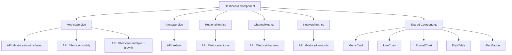

# Full Angular Dashboard Architecture Plan

## Executive Summary

This plan outlines the complete implementation of a comprehensive Angular dashboard for metrics visualization. The dashboard will include executive summary cards, interactive charts, funnel visualization, filterable tables, geographic breakdowns, and alert highlights.

## Technology Stack

### Core Technologies
- **Angular**: 18.2.0 (Standalone Components)
- **TypeScript**: 5.5.2
- **RxJS**: 7.8.0

### New Dependencies to Install
- **ng2-charts**: ^6.0.0 - Angular wrapper for Chart.js
- **chart.js**: ^4.4.0 - Charting library
- **@angular/material**: ^18.2.0 - Material Design components
- **@angular/cdk**: ^18.2.0 - Component Dev Kit (required by Material)

### Why These Libraries?
- **ng2-charts**: Provides excellent Angular integration with Chart.js, reactive data binding, and TypeScript support
- **Angular Material**: Consistent Material Design UI, built-in accessibility, and powerful table component with sorting/filtering
- **Chart.js**: Lightweight, flexible, and supports all required chart types (line, funnel)

## Data Architecture

### Extended Dashboard Models

Create a new interface that extends the existing [`MonthlyMetrics`](src/app/core/models/metrics.models.ts) to include all dashboard-specific fields:

```typescript
// src/app/core/models/dashboard.models.ts
export interface DashboardMetrics extends MonthlyMetrics {
  // Executive Summary Fields
  latestMrr: number;
  growthPercentageMoM: number;
  websiteTraffic: number;
  paidConversions: number;
  trialToPaidPercentage: number;
  churnRate: number;
  
  // Funnel Fields
  uniqueSignups: number;
  trialsStarted: number;
}

export interface FunnelData {
  stage: string;
  value: number;
  percentage: number;
}

export interface ChartDataPoint {
  label: string;
  value: number;
}

export interface AlertThresholds {
  mrrDropThreshold: number;
  trafficDropThreshold: number;
  lowConversionThreshold: number;
  highChurnThreshold: number;
}
```

### Data Flow Architecture



## Component Architecture

### 1. Dashboard Component Structure

```
dashboard/
├── dashboard.component.ts       # Main orchestrator
├── dashboard.component.html     # Template
├── dashboard.component.css      # Styles
└── dashboard.component.spec.ts  # Tests
```

**Responsibilities:**
- Orchestrate data loading from multiple services
- Manage loading and error states
- Pass data to child components
- Handle user interactions (filters, date ranges)

### 2. Shared Components to Create

#### A. Metric Card Component
```
shared/components/metric-card/
├── metric-card.component.ts
├── metric-card.component.html
├── metric-card.component.css
└── metric-card.component.spec.ts
```

**Props:**
- `title: string` - Card title
- `value: number | string` - Main metric value
- `growth?: number` - Growth percentage (optional)
- `icon?: string` - Material icon name (optional)
- `trend?: 'up' | 'down' | 'neutral'` - Trend indicator

**Features:**
- Color-coded growth indicators
- Responsive sizing
- Loading skeleton state

#### B. Line Chart Component
```
shared/components/line-chart/
├── line-chart.component.ts
├── line-chart.component.html
├── line-chart.component.css
└── line-chart.component.spec.ts
```

**Props:**
- `data: ChartDataPoint[]` - Chart data
- `label: string` - Dataset label
- `title: string` - Chart title
- `color?: string` - Line color

**Features:**
- Responsive canvas
- Interactive tooltips
- Smooth animations
- Grid lines and axis labels

#### C. Funnel Chart Component
```
shared/components/funnel-chart/
├── funnel-chart.component.ts
├── funnel-chart.component.html
├── funnel-chart.component.css
└── funnel-chart.component.spec.ts
```

**Props:**
- `data: FunnelData[]` - Funnel stages and values
- `title: string` - Chart title

**Features:**
- Visual funnel representation
- Percentage drop-off between stages
- Color-coded stages
- Responsive layout

#### D. Data Table Component
```
shared/components/data-table/
├── data-table.component.ts
├── data-table.component.html
├── data-table.component.css
└── data-table.component.spec.ts
```

**Props:**
- `data: any[]` - Table data
- `columns: TableColumn[]` - Column definitions
- `sortable: boolean` - Enable sorting
- `filterable: boolean` - Enable filtering

**Features:**
- Material Design table
- Column sorting
- Search/filter functionality
- Pagination
- Responsive (horizontal scroll on mobile)

#### E. Alert Badge Component
```
shared/components/alert-badge/
├── alert-badge.component.ts
├── alert-badge.component.html
├── alert-badge.component.css
└── alert-badge.component.spec.ts
```

**Props:**
- `alert: Alert` - Alert data
- `compact?: boolean` - Compact display mode

**Features:**
- Severity-based color coding
- Icon indicators
- Expandable details
- Dismissible (optional)

## Dashboard Layout Structure

### Section 1: Executive Summary Cards (Top Cards)

**Layout:** 4-column grid (responsive: 2 columns on tablet, 1 on mobile)

**Cards:**
1. **MRR Card**
   - Value: `latestMrr`
   - Growth: `growthPercentageMoM`
   - Icon: `attach_money`

2. **Website Traffic Card**
   - Value: `websiteTraffic`
   - Icon: `trending_up`

3. **Total Conversions Card**
   - Value: `paidConversions`
   - Icon: `shopping_cart`

4. **Conversion Rate Card**
   - Value: `trialToPaidPercentage`
   - Icon: `percent`

5. **Churn Rate Card**
   - Value: `churnRate`
   - Icon: `person_remove`
   - Alert: Highlight if above threshold

### Section 2: Line Charts (Trends Over Time)

**Layout:** 2x2 grid (responsive: 1 column on mobile)

**Charts:**
1. **MRR Trend**
   - Data: Monthly MRR values
   - X-axis: Months
   - Y-axis: MRR ($)

2. **Website Traffic Trend**
   - Data: Monthly traffic
   - X-axis: Months
   - Y-axis: Sessions

3. **Paid Conversions Trend**
   - Data: Monthly conversions
   - X-axis: Months
   - Y-axis: Conversions

4. **Conversion Rate Trend**
   - Data: Monthly conversion rate
   - X-axis: Months
   - Y-axis: Percentage (%)

### Section 3: Funnel Visualization

**Layout:** Full-width centered

**Stages:**
1. **Traffic** → `websiteTraffic`
2. **Signups** → `uniqueSignups`
3. **Trials** → `trialsStarted`
4. **Paid** → `paidConversions`

**Display:**
- Visual funnel with decreasing widths
- Percentage drop-off between stages
- Absolute numbers for each stage

### Section 4: Filterable/Sortable Tables

**Layout:** Tabbed interface or accordion sections

**Tables:**

#### A. Keywords Table
- **Columns:** Keyword, Sessions, Conversions, Conversion Rate
- **Sortable:** All columns
- **Filterable:** Search by keyword
- **Data Source:** [`MetricsService.getKeywordMetrics()`](src/app/core/services/metrics.service.ts:114)

#### B. Regions Table
- **Columns:** Region, Country, City, Sessions, Conversions, Conversion Rate, Churn
- **Sortable:** All columns
- **Filterable:** Search by location
- **Drill-down:** Click region to see countries, click country to see cities
- **Data Source:** [`MetricsService.getRegionalMetrics()`](src/app/core/services/metrics.service.ts:62)

#### C. Channels Table
- **Columns:** Channel, Sessions, Conversions, Conversion Rate
- **Sortable:** All columns
- **Filterable:** Search by channel
- **Data Source:** [`MetricsService.getChannelMetrics()`](src/app/core/services/metrics.service.ts:96)

### Section 5: Geographic Breakdown

**Layout:** Full-width section

**Options:**
1. **Map Visualization** (Future enhancement - use Leaflet or Google Maps)
2. **Hierarchical Table** (Initial implementation)
   - Expandable rows: Region → Countries → Cities
   - Metrics per level: Sessions, Conversions, Conversion Rate, Churn

### Section 6: Alerts/Highlights

**Layout:** Alert banner at top + inline badges near relevant metrics

**Alert Types:**

1. **MRR Drop Alert**
   - Trigger: `growthPercentageMoM < -threshold`
   - Display: Red badge on MRR card
   - Message: "MRR dropped by X% this month"

2. **Traffic Drop Alert**
   - Trigger: Traffic decrease > threshold
   - Display: Orange badge on Traffic card
   - Message: "Traffic decreased by X%"

3. **Low Conversion Rate Alert**
   - Trigger: `trialToPaidPercentage < threshold`
   - Display: Yellow badge on Conversion Rate card
   - Message: "Conversion rate below target"

4. **High Churn Alert**
   - Trigger: `churnRate > threshold`
   - Display: Red badge on Churn Rate card
   - Message: "Churn rate above acceptable level"

**Alert Data Source:** [`AlertsService.getAlerts()`](src/app/core/services/alerts.service.ts:24)

## Responsive Design Strategy

### Breakpoints
- **Desktop:** ≥1200px - Full multi-column layout
- **Tablet:** 768px - 1199px - 2-column layout
- **Mobile:** <768px - Single column, stacked layout

### Mobile Optimizations
- Cards stack vertically
- Charts maintain aspect ratio
- Tables scroll horizontally
- Funnel chart scales proportionally
- Touch-friendly tap targets (min 44px)

### CSS Grid Layout
```css
.dashboard-grid {
  display: grid;
  gap: 20px;
  grid-template-columns: repeat(auto-fit, minmax(280px, 1fr));
}

@media (max-width: 768px) {
  .dashboard-grid {
    grid-template-columns: 1fr;
  }
}
```

## State Management

### Loading States

**Per-Section Loading:**
- Executive cards: Skeleton loaders
- Charts: Spinner overlay
- Tables: Material progress bar
- Alerts: Shimmer effect

**Implementation:**
```typescript
interface DashboardState {
  executiveSummary: {
    loading: boolean;
    error: string | null;
    data: DashboardMetrics | null;
  };
  charts: {
    loading: boolean;
    error: string | null;
    data: MonthlyMetrics[] | null;
  };
  // ... other sections
}
```

### Error Handling

**Error Display Strategy:**
1. **Non-blocking errors:** Show error message but keep other sections functional
2. **Critical errors:** Show retry button
3. **Network errors:** Auto-retry with exponential backoff

**Error UI:**
- Inline error messages per section
- Toast notifications for transient errors
- Retry buttons for failed sections

## Performance Optimizations

### 1. Lazy Loading
- Load chart library only when needed
- Defer non-critical data (tables) until user scrolls

### 2. Data Caching
- Cache API responses for 5 minutes
- Use RxJS `shareReplay()` for shared observables

### 3. Change Detection
- Use `OnPush` change detection strategy
- Immutable data patterns

### 4. Virtual Scrolling
- Use Angular CDK virtual scrolling for large tables

## Accessibility (a11y)

### Requirements
- ARIA labels on all interactive elements
- Keyboard navigation support
- Screen reader announcements for data updates
- Color contrast ratio ≥4.5:1
- Focus indicators on all focusable elements

### Material Design Benefits
- Built-in accessibility features
- ARIA attributes automatically applied
- Keyboard navigation out-of-the-box

## Testing Strategy

### Unit Tests
- Component logic tests
- Service method tests
- Mock API responses

### Integration Tests
- Component interaction tests
- Data flow tests

### E2E Tests (Future)
- Full user journey tests
- Cross-browser testing

## Implementation Phases

### Phase 1: Setup & Infrastructure
1. Install dependencies
2. Create extended models
3. Set up Angular Material theme
4. Create base component structure

### Phase 2: Shared Components
1. Metric Card component
2. Line Chart component
3. Funnel Chart component
4. Data Table component
5. Alert Badge component

### Phase 3: Dashboard Integration
1. Update dashboard component to load all data
2. Implement executive summary section
3. Implement charts section
4. Implement funnel section

### Phase 4: Tables & Geographic
1. Implement keywords table
2. Implement regions table
3. Implement channels table
4. Implement geographic breakdown

### Phase 5: Alerts & Polish
1. Implement alerts section
2. Add responsive styling
3. Add loading states
4. Add error handling
5. Add debug section

### Phase 6: Testing & Refinement
1. Test with real API
2. Fix bugs and edge cases
3. Performance optimization
4. Accessibility audit

## File Structure After Implementation

```
src/app/
├── core/
│   ├── models/
│   │   ├── dashboard.models.ts          # NEW
│   │   ├── alerts.models.ts
│   │   ├── metrics.models.ts
│   │   └── index.ts
│   └── services/
│       ├── alerts.service.ts
│       ├── metrics.service.ts
│       └── index.ts
├── features/
│   └── dashboard/
│       ├── dashboard.component.ts       # UPDATED
│       ├── dashboard.component.html     # UPDATED
│       ├── dashboard.component.css      # UPDATED
│       └── dashboard.component.spec.ts
└── shared/
    └── components/
        ├── metric-card/                 # NEW
        │   ├── metric-card.component.ts
        │   ├── metric-card.component.html
        │   ├── metric-card.component.css
        │   └── metric-card.component.spec.ts
        ├── line-chart/                  # NEW
        │   ├── line-chart.component.ts
        │   ├── line-chart.component.html
        │   ├── line-chart.component.css
        │   └── line-chart.component.spec.ts
        ├── funnel-chart/                # NEW
        │   ├── funnel-chart.component.ts
        │   ├── funnel-chart.component.html
        │   ├── funnel-chart.component.css
        │   └── funnel-chart.component.spec.ts
        ├── data-table/                  # NEW
        │   ├── data-table.component.ts
        │   ├── data-table.component.html
        │   ├── data-table.component.css
        │   └── data-table.component.spec.ts
        └── alert-badge/                 # NEW
            ├── alert-badge.component.ts
            ├── alert-badge.component.html
            ├── alert-badge.component.css
            └── alert-badge.component.spec.ts
```

## Dependencies Installation Command

```bash
npm install ng2-charts chart.js @angular/material @angular/cdk
```

## Material Theme Setup

Add to [`src/styles.css`](src/styles.css):
```css
@import '@angular/material/prebuilt-themes/indigo-pink.css';
```

## API Endpoints Used

### Primary Endpoints
- `GET /api/Metrics/monthly/latest` - Executive summary data
- `GET /api/Metrics/monthly` - Historical data for charts
- `GET /api/Metrics/monthly/mrr-growth` - MRR trend data
- `GET /api/Metrics/keywords` - Keywords table data
- `GET /api/Metrics/regional` - Regional breakdown data
- `GET /api/Metrics/channels` - Channels table data
- `GET /api/Alerts` - Alert notifications

### Supporting Endpoints
- `GET /api/Metrics/regional/trial-to-paid` - Conversion funnel data
- `GET /api/Metrics/regional/traffic-trends` - Traffic analysis
- `GET /api/Alerts/high-traffic-low-conversion` - Specific alerts

## Configuration & Thresholds

Define alert thresholds in [`environment.ts`](src/environments/environment.ts):
```typescript
export const environment = {
  production: false,
  apiUrl: 'http://localhost:5090/api',
  alertThresholds: {
    mrrDropThreshold: -5,        // -5% MRR drop
    trafficDropThreshold: -10,   // -10% traffic drop
    lowConversionThreshold: 2,   // <2% conversion rate
    highChurnThreshold: 5        // >5% churn rate
  }
};
```

## Color Palette

### Status Colors
- **Success/Positive:** `#4caf50` (Green)
- **Warning:** `#ff9800` (Orange)
- **Error/Negative:** `#f44336` (Red)
- **Info:** `#2196f3` (Blue)
- **Neutral:** `#9e9e9e` (Gray)

### Chart Colors
- **Primary:** `#3f51b5` (Indigo)
- **Secondary:** `#ff4081` (Pink)
- **Accent:** `#00bcd4` (Cyan)

## Debug Section

Add collapsible debug section at bottom showing:
- Raw API responses
- Current state
- Loading flags
- Error messages
- Timestamp of last data fetch

## Next Steps

Once this plan is approved, we will:
1. Switch to Code mode to implement the solution
2. Follow the implementation phases sequentially
3. Test each component as it's built
4. Integrate everything into the dashboard
5. Perform final testing and refinement

## Questions & Considerations

### Potential Enhancements (Future)
- Real-time data updates with WebSockets
- Export functionality (PDF, Excel)
- Custom date range picker
- Dashboard customization (drag-and-drop widgets)
- Dark mode theme
- Multi-language support
- Advanced filtering (date ranges, custom filters)
- Comparison mode (compare periods)

### Performance Considerations
- Initial load time target: <3 seconds
- Chart rendering: <500ms
- Table sorting/filtering: <100ms
- Smooth animations (60fps)

### Browser Support
- Chrome/Edge (latest 2 versions)
- Firefox (latest 2 versions)
- Safari (latest 2 versions)
- Mobile browsers (iOS Safari, Chrome Mobile)

---

**Plan Status:** Ready for Review  
**Estimated Components:** 10 new components + 1 updated component  
**Estimated Files:** ~40 new files  
**Dependencies:** 4 new packages
