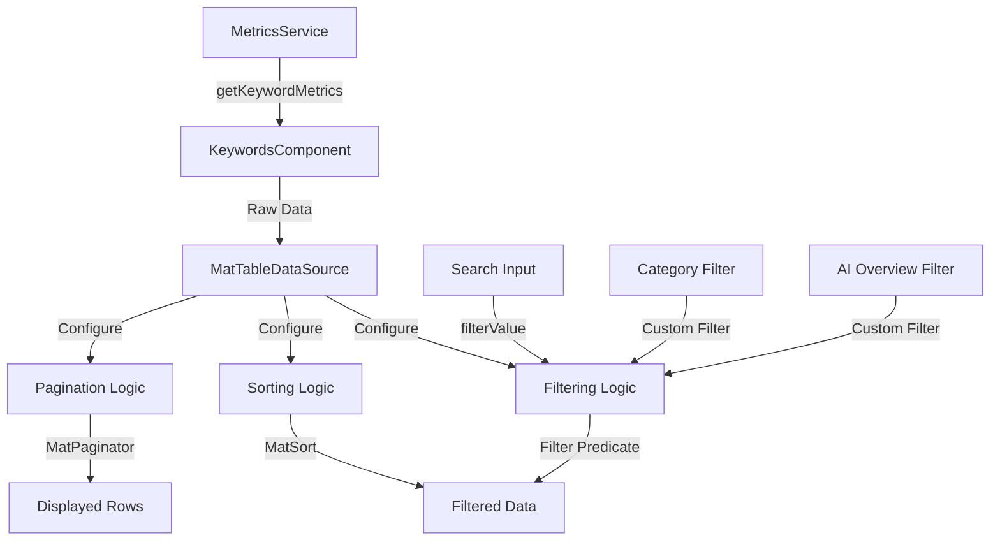

# Keywords Tab - Angular Material Table Architecture

## Overview
This document outlines the architecture for implementing a comprehensive Angular Material table in the Keywords tab, featuring sorting, pagination, global search, and filtering capabilities.

## Current State Analysis

### Existing Components
- **KeywordsComponent**: Located at [`src/app/features/keywords/keywords.component.ts`](src/app/features/keywords/keywords.component.ts)
- **Data Model**: [`KeywordMetrics`](src/app/core/models/metrics.models.ts:141) interface with all required fields
- **Service**: [`MetricsService.getKeywordMetrics()`](src/app/core/services/metrics.service.ts:98) endpoint available
- **Dependencies**: Angular Material v18.2.14 already installed

### Data Structure
```typescript
interface KeywordMetrics {
  keyword: string;
  category?: string;
  trafficChangeYoY?: number;
  traffic2024?: number;
  traffic2025?: number;
  conversionRate2024?: number;
  conversionRate2025?: number;
  position2024?: number;
  position2025?: number;
  positionChange?: number;
  aiOverviewTriggered?: string;
}
```

## Architecture Design

### Component Structure

```
KeywordsComponent
├── Search Bar (MatFormField + MatInput)
├── Filters Section
│   ├── Category Filter (MatSelect)
│   └── AI Overview Filter (MatSelect)
├── Angular Material Table (MatTable)
│   ├── Column Definitions (11 columns)
│   ├── MatSort (sorting)
│   └── MatPaginator (pagination)
└── Data Source (MatTableDataSource)
```

### Table Columns Configuration

| Column | Field | Type | Sortable | Format |
|--------|-------|------|----------|--------|
| Keyword | keyword | string | Yes | Text |
| Category | category | string | Yes | Text |
| Traffic Change YoY | trafficChangeYoY | number | Yes | Percentage with color |
| Traffic 2024 | traffic2024 | number | Yes | Number with commas |
| Traffic 2025 | traffic2025 | number | Yes | Number with commas |
| Conv. Rate 2024 | conversionRate2024 | number | Yes | Percentage (2 decimals) |
| Conv. Rate 2025 | conversionRate2025 | number | Yes | Percentage (2 decimals) |
| Position 2024 | position2024 | number | Yes | Integer |
| Position 2025 | position2025 | number | Yes | Integer |
| Position Change | positionChange | number | Yes | Integer with +/- indicator |
| AI Overview | aiOverviewTriggered | string | Yes | Yes/No badge |

### Features Implementation

#### 1. Sorting
- **Implementation**: MatSort directive
- **Behavior**: Click column headers to sort ascending/descending
- **Visual Indicator**: Arrow icons showing sort direction
- **Default Sort**: Traffic 2025 descending

#### 2. Pagination
- **Implementation**: MatPaginator component
- **Page Size Options**: [10, 25, 50, 100]
- **Default Page Size**: 25
- **Position**: Bottom of table
- **Features**: First/Last page buttons, page size selector

#### 3. Global Search
- **Implementation**: MatFormField with MatInput
- **Behavior**: Real-time filtering across all columns
- **Debounce**: 300ms to optimize performance
- **Case-insensitive**: Search matches regardless of case
- **Clear Button**: X icon to clear search

#### 4. Filters

##### Category Filter
- **Type**: MatSelect dropdown
- **Options**: Dynamic list from unique categories in data
- **Default**: "All Categories"
- **Behavior**: Filters table to show only selected category
- **Clearable**: Yes

##### AI Overview Triggered Filter
- **Type**: MatSelect dropdown
- **Options**: ["All", "Yes", "No"]
- **Default**: "All"
- **Behavior**: Filters based on aiOverviewTriggered field
- **Clearable**: Yes

### Data Flow



### State Management

```typescript
// Component State
{
  dataSource: MatTableDataSource<KeywordMetrics>;
  displayedColumns: string[];
  loading: boolean;
  error: string | null;
  
  // Filter State
  searchValue: string;
  selectedCategory: string;
  selectedAiOverview: string;
  categories: string[];
  
  // Pagination State (managed by MatPaginator)
  pageSize: number;
  pageIndex: number;
  
  // Sort State (managed by MatSort)
  sortActive: string;
  sortDirection: 'asc' | 'desc';
}
```

## Required Angular Material Modules

The following modules need to be imported in the KeywordsComponent:

```typescript
import { MatTableModule } from '@angular/material/table';
import { MatSortModule } from '@angular/material/sort';
import { MatPaginatorModule } from '@angular/material/paginator';
import { MatFormFieldModule } from '@angular/material/form-field';
import { MatInputModule } from '@angular/material/input';
import { MatSelectModule } from '@angular/material/select';
import { MatIconModule } from '@angular/material/icon';
import { MatButtonModule } from '@angular/material/button';
import { MatProgressSpinnerModule } from '@angular/material/progress-spinner';
import { MatChipsModule } from '@angular/material/chips'; // For badges
import { ReactiveFormsModule } from '@angular/forms';
```

## Visual Design Specifications

### Color Coding
- **Positive Changes**: Green (#4caf50)
  - Traffic increase (trafficChangeYoY > 0)
  - Position improvement (positionChange > 0)
- **Negative Changes**: Red (#f44336)
  - Traffic decrease (trafficChangeYoY < 0)
  - Position decline (positionChange < 0)
- **Neutral**: Gray (#757575)
  - No change or N/A values

### Layout
- **Search Bar**: Full width at top, with search icon
- **Filters**: Horizontal row below search, 2 filters side-by-side
- **Table**: Full width, responsive, horizontal scroll on small screens
- **Pagination**: Centered at bottom

### Responsive Behavior
- **Desktop (>1200px)**: All columns visible
- **Tablet (768-1200px)**: Horizontal scroll enabled
- **Mobile (<768px)**: Horizontal scroll, sticky first column (keyword)

## Custom Filter Logic

The MatTableDataSource will use a custom filter predicate that combines:
1. Global search across all text fields
2. Category exact match filter
3. AI Overview exact match filter

```typescript
filterPredicate = (data: KeywordMetrics, filter: string): boolean => {
  const filterObject = JSON.parse(filter);
  
  // Global search
  const searchMatch = !filterObject.search || 
    Object.values(data).some(val => 
      String(val).toLowerCase().includes(filterObject.search.toLowerCase())
    );
  
  // Category filter
  const categoryMatch = !filterObject.category || 
    filterObject.category === 'all' ||
    data.category === filterObject.category;
  
  // AI Overview filter
  const aiOverviewMatch = !filterObject.aiOverview || 
    filterObject.aiOverview === 'all' ||
    data.aiOverviewTriggered === filterObject.aiOverview;
  
  return searchMatch && categoryMatch && aiOverviewMatch;
};
```

## Performance Considerations

1. **Virtual Scrolling**: Not needed initially (dataset < 1000 rows)
2. **Change Detection**: Use OnPush strategy if possible
3. **Debouncing**: Apply to search input (300ms)
4. **Lazy Loading**: Not needed (single API call)
5. **Memoization**: Cache unique categories list

## Error Handling

- **Loading State**: Show MatProgressSpinner overlay
- **Error State**: Display error message with retry button
- **Empty State**: Show "No keywords found" message
- **No Results**: Show "No results match your filters" when filtered

## Accessibility

- **ARIA Labels**: All interactive elements labeled
- **Keyboard Navigation**: Full keyboard support for table, filters, pagination
- **Screen Reader**: Announce sort changes, filter updates, page changes
- **Focus Management**: Proper focus indicators and tab order

## Testing Strategy

### Unit Tests
- Filter logic (search, category, AI overview)
- Sort functionality
- Pagination behavior
- Data transformation and formatting

### Integration Tests
- API data loading
- Filter combinations
- Sort + filter + pagination interactions

### E2E Tests
- Complete user workflows
- Search and filter scenarios
- Pagination navigation

## Migration Path

### Phase 1: Basic Table (Current Task)
- Replace existing HTML table with MatTable
- Implement all 11 columns
- Add sorting capability
- Add pagination
- Add global search
- Add filters

### Phase 2: Enhancements (Future)
- Export to CSV/Excel
- Column visibility toggle
- Advanced filters (range filters for numeric values)
- Bulk actions
- Row selection

### Phase 3: Advanced Features (Future)
- Virtual scrolling for large datasets
- Server-side pagination/sorting/filtering
- Real-time updates
- Comparison mode (side-by-side years)

## Implementation Checklist

This checklist will be used by Code mode to implement the solution:

### Setup
- [ ] Import all required Angular Material modules
- [ ] Import ReactiveFormsModule for form controls
- [ ] Add ViewChild decorators for MatSort and MatPaginator

### Component Class
- [ ] Add MatTableDataSource property
- [ ] Define displayedColumns array with all 11 columns
- [ ] Add filter state properties (searchValue, selectedCategory, selectedAiOverview)
- [ ] Add categories array for dynamic category list
- [ ] Implement ngAfterViewInit to connect sort and paginator
- [ ] Create custom filter predicate function
- [ ] Implement applyFilter method for search
- [ ] Implement applyCategoryFilter method
- [ ] Implement applyAiOverviewFilter method
- [ ] Extract unique categories from data
- [ ] Initialize MatTableDataSource with data from API

### Template
- [ ] Create search input with MatFormField and MatInput
- [ ] Add clear button to search field
- [ ] Create category filter with MatSelect
- [ ] Create AI Overview filter with MatSelect
- [ ] Build MatTable with all 11 columns
- [ ] Add matSort directive to table
- [ ] Add mat-sort-header to each column header
- [ ] Implement custom cell templates for formatted values
- [ ] Add color coding for positive/negative changes
- [ ] Add MatPaginator below table
- [ ] Add loading spinner overlay
- [ ] Add error state display
- [ ] Add empty state display

### Styling
- [ ] Add Material theme styles
- [ ] Style search and filter section
- [ ] Add color classes for positive/negative values
- [ ] Style AI Overview badges
- [ ] Add responsive styles for mobile
- [ ] Style loading and error states
- [ ] Add hover effects for table rows

### Data Formatting
- [ ] Format traffic numbers with commas
- [ ] Format percentages with 2 decimals
- [ ] Format position changes with +/- indicators
- [ ] Format AI Overview as Yes/No badges
- [ ] Handle null/undefined values gracefully

### Testing
- [ ] Test sorting on each column
- [ ] Test pagination with different page sizes
- [ ] Test global search functionality
- [ ] Test category filter
- [ ] Test AI Overview filter
- [ ] Test combined filters
- [ ] Test loading state
- [ ] Test error state
- [ ] Test empty state
- [ ] Test responsive behavior

## File Changes Required

### Modified Files
1. [`src/app/features/keywords/keywords.component.ts`](src/app/features/keywords/keywords.component.ts)
   - Complete rewrite with MatTable implementation
   
2. [`src/app/features/keywords/keywords.component.html`](src/app/features/keywords/keywords.component.html)
   - Replace with Angular Material table template
   
3. [`src/app/features/keywords/keywords.component.css`](src/app/features/keywords/keywords.component.css)
   - Add Material Design styles

### No New Files Needed
All changes will be made to existing Keywords component files.

## API Integration

The component will continue using the existing API endpoint:
- **Endpoint**: `GET /Metrics/keywords`
- **Service Method**: [`MetricsService.getKeywordMetrics()`](src/app/core/services/metrics.service.ts:98)
- **Response Type**: [`KeywordMetrics[]`](src/app/core/models/metrics.models.ts:141)

No backend changes required - the API already returns all necessary fields.

## Summary

This architecture provides a robust, scalable solution for displaying keyword metrics in an Angular Material table with comprehensive filtering, sorting, and search capabilities. The implementation leverages Angular Material's built-in features while maintaining clean separation of concerns and following Angular best practices.

The design is:
- **User-friendly**: Intuitive search and filter controls
- **Performant**: Efficient client-side filtering and pagination
- **Accessible**: Full keyboard and screen reader support
- **Maintainable**: Clean code structure with clear responsibilities
- **Extensible**: Easy to add new features in future phases
