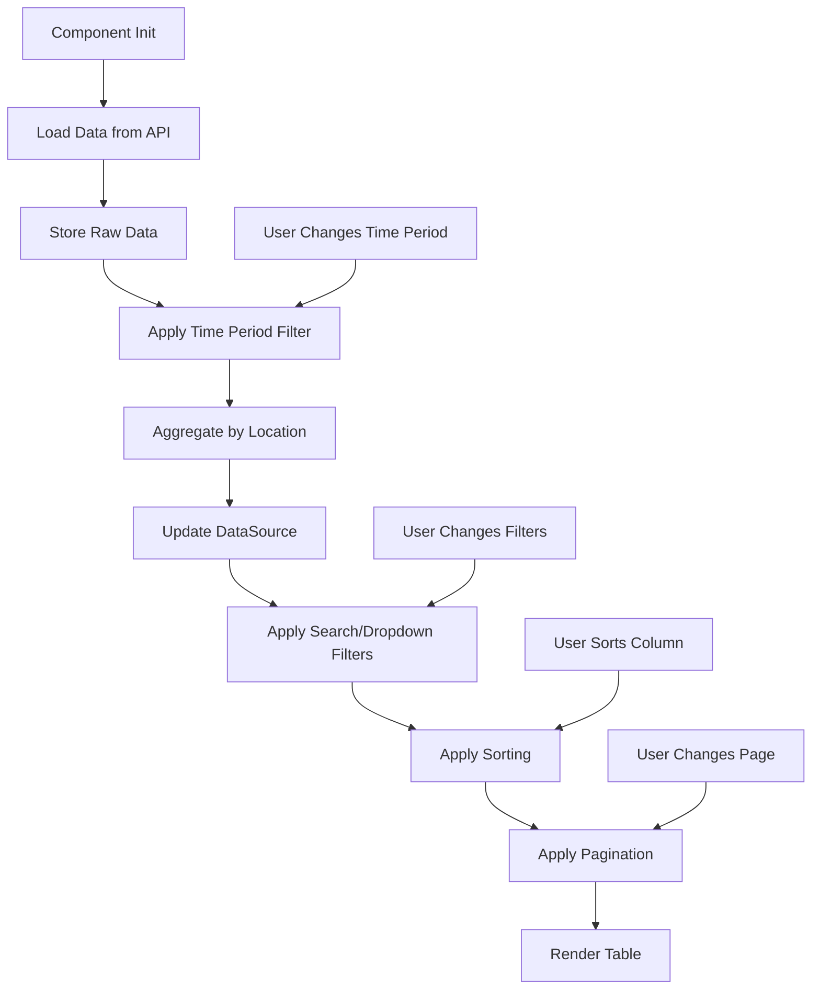

# RegionsComponent Architecture Plan

## Overview
Build an Angular standalone component that displays regional performance metrics in a Material table with advanced filtering, sorting, and pagination capabilities.

## Component Structure

### File Organization
```
src/app/features/regions/
├── regions.component.ts      (Component logic)
├── regions.component.html    (Template)
├── regions.component.css     (Styles)
└── regions.component.spec.ts (Tests - existing)
```

## Data Model

### Extended RegionalMetrics Interface
Extend the existing [`RegionalMetrics`](src/app/core/models/metrics.models.ts:35) interface to include:

```typescript
export interface RegionalMetrics {
  // Existing fields
  region: string;
  country?: string;
  city?: string;
  
  // NEW: Monthly tracking
  month?: string;        // e.g., "2024-01" or "January 2024"
  
  // NEW: Traffic breakdown
  organicTraffic?: number;
  paidTraffic?: number;
  totalTraffic?: number;  // Already exists
  
  // NEW: Conversion metrics
  trialsStarted?: number;
  paidConversions?: number;
  trialToPaidRate?: number;  // Percentage
  
  // NEW: Financial metrics
  mrrUsd?: number;
  cacUsd?: number;
  ltvUsd?: number;
  
  // Existing aggregated fields
  sessions?: number;
  conversions?: number;
  conversionRate?: number;
  revenue?: number;
  trialUsers?: number;
  paidUsers?: number;
  ratio?: number;
  
  // Keep index signature
  [key: string]: any;
}
```

## Component Features

### 1. Table Columns
Display all 13 columns as specified:
- `region` (string, sortable)
- `country` (string, sortable)
- `city` (string, sortable)
- `month` (string, sortable)
- `organicTraffic` (number, sortable, formatted)
- `paidTraffic` (number, sortable, formatted)
- `totalTraffic` (number, sortable, formatted)
- `trialsStarted` (number, sortable, formatted)
- `paidConversions` (number, sortable, formatted)
- `trialToPaidRate` (percentage, sortable, formatted)
- `mrrUsd` (currency, sortable, formatted)
- `cacUsd` (currency, sortable, formatted)
- `ltvUsd` (currency, sortable, formatted)

### 2. Search Functionality
- Single search bar with debounced input (300ms)
- Filters across: `region`, `country`, `city`
- Case-insensitive matching
- Clear button when search has value

### 3. Dropdown Filters

#### Region Filter
- Options: "All Regions" + unique regions from data
- Material select with icon

#### Country Filter
- Options: "All Countries" + unique countries from data
- Material select with icon
- Dynamically filtered based on selected region

#### City Filter
- Options: "All Cities" + unique cities from data
- Material select with icon
- Dynamically filtered based on selected country

#### Time Period Filter
- Options:
  - "Last 3 Months"
  - "Last 6 Months"
  - "Last 9 Months"
  - "Last 12 Months"
- Default: "Last 12 Months"
- Material select with icon

### 4. Time Period Aggregation Logic

When a time period is selected:
1. Filter records to include only the last N months
2. Group by region, country, city
3. Calculate averages for numeric columns:
   - `organicTraffic` → average
   - `paidTraffic` → average
   - `totalTraffic` → average
   - `trialsStarted` → average
   - `paidConversions` → average
   - `trialToPaidRate` → average
   - `mrrUsd` → average
   - `cacUsd` → average
   - `ltvUsd` → average
4. Display aggregated results in table

### 5. Sorting
- All columns sortable via Material Sort
- Default sort: `totalTraffic` descending
- Sticky header for better UX

### 6. Pagination
- Material Paginator
- Page size options: [10, 25, 50, 100]
- Default page size: 10
- Show first/last buttons
- Display results count

### 7. Loading State
- Material spinner overlay
- Message: "Loading regional data..."
- Prevents interaction during load

### 8. Error State
- Error icon and message
- Retry button with refresh icon
- Centered layout

### 9. Empty State
- Display when no data matches filters
- Icon, message, and "Clear Filters" button

## Component Implementation Details

### TypeScript Structure

```typescript
@Component({
  selector: 'app-regions',
  standalone: true,
  imports: [
    CommonModule,
    ReactiveFormsModule,
    MatTableModule,
    MatSortModule,
    MatPaginatorModule,
    MatFormFieldModule,
    MatInputModule,
    MatSelectModule,
    MatIconModule,
    MatButtonModule,
    MatProgressSpinnerModule
  ],
  templateUrl: './regions.component.html',
  styleUrls: ['./regions.component.css'],
  changeDetection: ChangeDetectionStrategy.Default
})
export class RegionsComponent implements OnInit, AfterViewInit {
  // ViewChild references
  @ViewChild(MatSort) sort!: MatSort;
  @ViewChild(MatPaginator) paginator!: MatPaginator;
  
  // Data source
  dataSource = new MatTableDataSource<RegionalMetrics>([]);
  
  // State
  loading = false;
  error: string | null = null;
  
  // Raw data (for time period filtering)
  private rawData: RegionalMetrics[] = [];
  
  // Filter options
  regions: string[] = [];
  countries: string[] = [];
  cities: string[] = [];
  
  // Form controls
  searchControl = new FormControl('');
  regionControl = new FormControl('all');
  countryControl = new FormControl('all');
  cityControl = new FormControl('all');
  timePeriodControl = new FormControl(12); // Default: 12 months
  
  // Filter state
  private filterState = {
    search: '',
    region: 'all',
    country: 'all',
    city: 'all'
  };
  
  // Displayed columns
  displayedColumns = [
    'region',
    'country',
    'city',
    'month',
    'organicTraffic',
    'paidTraffic',
    'totalTraffic',
    'trialsStarted',
    'paidConversions',
    'trialToPaidRate',
    'mrrUsd',
    'cacUsd',
    'ltvUsd'
  ];
}
```

### Key Methods

#### Data Loading
```typescript
loadRegionalData(): void {
  this.loading = true;
  this.error = null;
  
  this.metricsService.getAllRegionalPerformance()
    .pipe(takeUntilDestroyed(this.destroyRef))
    .subscribe({
      next: (data) => {
        this.rawData = data;
        this.applyTimePeriodFilter();
        this.extractFilterOptions(data);
        this.loading = false;
      },
      error: (err) => {
        this.error = err.message || 'Failed to load regional metrics';
        this.loading = false;
      }
    });
}
```

#### Time Period Filtering
```typescript
applyTimePeriodFilter(): void {
  const months = this.timePeriodControl.value || 12;
  const cutoffDate = this.getMonthsAgo(months);
  
  // Filter records within time period
  const filtered = this.rawData.filter(record => {
    const recordDate = new Date(record.month || '');
    return recordDate >= cutoffDate;
  });
  
  // Group and aggregate by region, country, city
  const aggregated = this.aggregateByLocation(filtered);
  
  // Update data source
  this.dataSource.data = aggregated;
}
```

#### Aggregation Logic
```typescript
aggregateByLocation(records: RegionalMetrics[]): RegionalMetrics[] {
  const grouped = new Map<string, RegionalMetrics[]>();
  
  // Group by region-country-city
  records.forEach(record => {
    const key = `${record.region}-${record.country}-${record.city}`;
    if (!grouped.has(key)) {
      grouped.set(key, []);
    }
    grouped.get(key)!.push(record);
  });
  
  // Calculate averages for each group
  return Array.from(grouped.values()).map(group => {
    const first = group[0];
    const count = group.length;
    
    return {
      region: first.region,
      country: first.country,
      city: first.city,
      month: `${count} months avg`,
      organicTraffic: this.average(group, 'organicTraffic'),
      paidTraffic: this.average(group, 'paidTraffic'),
      totalTraffic: this.average(group, 'totalTraffic'),
      trialsStarted: this.average(group, 'trialsStarted'),
      paidConversions: this.average(group, 'paidConversions'),
      trialToPaidRate: this.average(group, 'trialToPaidRate'),
      mrrUsd: this.average(group, 'mrrUsd'),
      cacUsd: this.average(group, 'cacUsd'),
      ltvUsd: this.average(group, 'ltvUsd')
    };
  });
}
```

#### Custom Filter Predicate
```typescript
createFilterPredicate() {
  return (data: RegionalMetrics, filter: string): boolean => {
    const filterObj = JSON.parse(filter);
    const searchTerm = filterObj.search.toLowerCase();
    
    // Search match
    const searchMatch = !searchTerm ||
      data.region?.toLowerCase().includes(searchTerm) ||
      data.country?.toLowerCase().includes(searchTerm) ||
      data.city?.toLowerCase().includes(searchTerm);
    
    // Dropdown filters
    const regionMatch = filterObj.region === 'all' || 
      data.region === filterObj.region;
    const countryMatch = filterObj.country === 'all' || 
      data.country === filterObj.country;
    const cityMatch = filterObj.city === 'all' || 
      data.city === filterObj.city;
    
    return searchMatch && regionMatch && countryMatch && cityMatch;
  };
}
```

#### Formatting Methods
```typescript
formatNumber(value: number | undefined | null): string {
  if (value === undefined || value === null) return '-';
  return value.toLocaleString('en-US');
}

formatCurrency(value: number | undefined | null): string {
  if (value === undefined || value === null) return '-';
  return `$${value.toLocaleString('en-US', { 
    minimumFractionDigits: 2, 
    maximumFractionDigits: 2 
  })}`;
}

formatPercentage(value: number | undefined | null): string {
  if (value === undefined || value === null) return '-';
  return `${value.toFixed(2)}%`;
}
```

## HTML Template Structure

```html
<div class="regions-container">
  <!-- Header -->
  <div class="header">
    <h1>Regional Performance</h1>
  </div>

  <!-- Loading overlay -->
  <div *ngIf="loading" class="loading-overlay">
    <mat-spinner></mat-spinner>
    <p>Loading regional data...</p>
  </div>

  <!-- Error state -->
  <div *ngIf="error && !loading" class="error-state">
    <mat-icon>error_outline</mat-icon>
    <p>{{ error }}</p>
    <button mat-raised-button color="primary" (click)="retry()">
      <mat-icon>refresh</mat-icon> Retry
    </button>
  </div>

  <!-- Content -->
  <div class="content" [class.hidden]="loading || error">
    
    <!-- Filters Section -->
    <div class="filters-section">
      <!-- Search bar -->
      <mat-form-field class="search-field" appearance="outline">
        <mat-icon matIconPrefix>search</mat-icon>
        <input matInput [formControl]="searchControl" 
               placeholder="Search by region, country, or city" 
               autocomplete="off">
        <button mat-icon-button matSuffix 
                *ngIf="searchControl.value" 
                (click)="clearSearch()">
          <mat-icon>close</mat-icon>
        </button>
      </mat-form-field>

      <!-- Filter controls -->
      <div class="filter-controls">
        <mat-form-field appearance="outline">
          <mat-label>Region</mat-label>
          <mat-select [formControl]="regionControl">
            <mat-option value="all">All Regions</mat-option>
            <mat-option *ngFor="let region of regions" [value]="region">
              {{ region }}
            </mat-option>
          </mat-select>
          <mat-icon matPrefix>public</mat-icon>
        </mat-form-field>

        <mat-form-field appearance="outline">
          <mat-label>Country</mat-label>
          <mat-select [formControl]="countryControl">
            <mat-option value="all">All Countries</mat-option>
            <mat-option *ngFor="let country of countries" [value]="country">
              {{ country }}
            </mat-option>
          </mat-select>
          <mat-icon matPrefix>flag</mat-icon>
        </mat-form-field>

        <mat-form-field appearance="outline">
          <mat-label>City</mat-label>
          <mat-select [formControl]="cityControl">
            <mat-option value="all">All Cities</mat-option>
            <mat-option *ngFor="let city of cities" [value]="city">
              {{ city }}
            </mat-option>
          </mat-select>
          <mat-icon matPrefix>location_city</mat-icon>
        </mat-form-field>

        <mat-form-field appearance="outline">
          <mat-label>Time Period</mat-label>
          <mat-select [formControl]="timePeriodControl">
            <mat-option [value]="3">Last 3 Months</mat-option>
            <mat-option [value]="6">Last 6 Months</mat-option>
            <mat-option [value]="9">Last 9 Months</mat-option>
            <mat-option [value]="12">Last 12 Months</mat-option>
          </mat-select>
          <mat-icon matPrefix>date_range</mat-icon>
        </mat-form-field>

        <button mat-stroked-button (click)="resetFilters()" class="reset-button">
          <mat-icon>filter_alt_off</mat-icon> Reset Filters
        </button>
      </div>
    </div>

    <!-- Results info -->
    <div class="results-info">
      <p>
        <strong>{{ dataSource.filteredData.length }}</strong>
        <span *ngIf="dataSource.filteredData.length !== dataSource.data.length">
          of {{ dataSource.data.length }}
        </span>
        regions
      </p>
    </div>

    <!-- Table -->
    <div class="table-container">
      <table mat-table [dataSource]="dataSource" matSort 
             matSortActive="totalTraffic" matSortDirection="desc" 
             class="regions-table">

        <!-- Column definitions for all 13 columns -->
        <!-- ... (see implementation) -->

        <tr mat-header-row *matHeaderRowDef="displayedColumns; sticky: true"></tr>
        <tr mat-row *matRowDef="let row; columns: displayedColumns;" 
            class="table-row"></tr>

        <!-- No data row -->
        <tr class="mat-row no-data-row" *matNoDataRow>
          <td class="mat-cell" [attr.colspan]="displayedColumns.length">
            <div class="no-data">
              <mat-icon>search_off</mat-icon>
              <p>No regions match your filters</p>
              <button mat-button color="primary" (click)="resetFilters()">
                Clear Filters
              </button>
            </div>
          </td>
        </tr>
      </table>
    </div>

    <!-- Paginator -->
    <mat-paginator [pageSizeOptions]="[10,25,50,100]" 
                   [pageSize]="10" 
                   showFirstLastButtons 
                   aria-label="Select page of regions">
    </mat-paginator>
  </div>
</div>
```

## CSS Styling

Follow the same pattern as [`keywords.component.css`](src/app/features/keywords/keywords.component.css:1):
- Container with padding and flex layout
- Loading overlay with spinner
- Error state with icon and retry button
- Filters section with background and rounded corners
- Table with sticky header and hover effects
- Responsive design for mobile devices
- Accessibility focus styles

## Data Flow Diagram



## Integration Points

### Service Layer
- Uses existing [`MetricsService.getAllRegionalPerformance()`](src/app/core/services/metrics.service.ts:63)
- Returns `Observable<RegionalMetrics[]>`

### Models
- Extends [`RegionalMetrics`](src/app/core/models/metrics.models.ts:35) interface
- Exports updated interface from [`index.ts`](src/app/core/models/index.ts:1)

### Routing
- Component already registered in routes (assumed)
- Accessible via navigation

## Best Practices Applied

1. **Standalone Component**: Modern Angular pattern
2. **Reactive Forms**: For filter controls
3. **RxJS Operators**: debounceTime, distinctUntilChanged, takeUntilDestroyed
4. **Change Detection**: Default strategy for simplicity
5. **Type Safety**: Strong typing throughout
6. **Accessibility**: ARIA labels, focus styles, keyboard navigation
7. **Responsive Design**: Mobile-friendly layout
8. **Error Handling**: Comprehensive error states
9. **Performance**: Debounced search, efficient filtering
10. **Maintainability**: Clear structure, reusable methods, comments

## Testing Considerations

- Unit tests for aggregation logic
- Unit tests for filter predicates
- Unit tests for formatting methods
- Integration tests with MetricsService
- E2E tests for user interactions

## Future Enhancements

- Export to CSV/Excel
- Column visibility toggle
- Advanced filtering (date range picker)
- Drill-down to city-level details
- Comparison mode (compare time periods)
- Charts/visualizations
- Real-time updates via WebSocket
